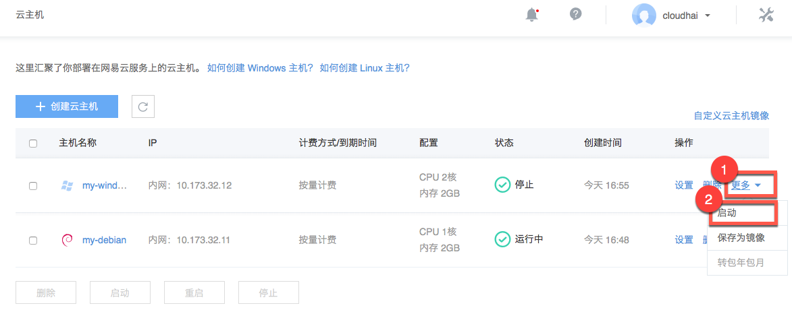
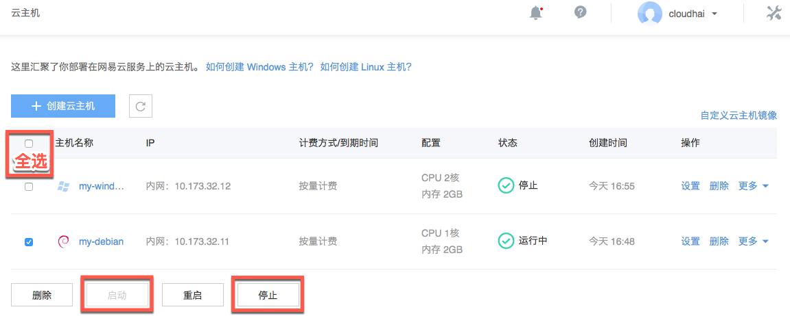

# 启动／停止实例

Note:
停止操作通常与主机内部执行关机操作相同，并不会停止计费。
停止操作只能在实例处于「运行中」状态时进行；
启动操作只能在实例处于「停止」状态时进行；
停止实例将中断你的业务，请谨慎操作。

Attention:
我们提供的关机操作通常是与你在云主机内部执行「关机」操作相同的，但是也有一些情况下，两分钟内你的云主机都没有正常关闭，在这种情况下，为了减少你的等待时间，我们会强制关机，这时的操作相当于对你的云主机执行下电操作，可能会导致内存中的磁盘缓存数据丢失，以及启动后进入修复模式； 针对上述两种可能的问题，如果你的云主机在重启后超过五分钟仍然不可连接，建议你通过 VNC 方式检查云主机是否进入了修复模式，如果是，请退出修复模式并重启，选择正常启动来解决，另外我们还建议通过 VNC 登录后在云主机内部执行「关机」或者「重启」操作，来避免进入修复模式带来的不便。

## 启动／停止方式一

1. 登录 [控制台](https://c.163.com/dashboard#/m/win/)，定位到目标实例；
2. 在右侧 「**操作**」 列中，点击「**更多**」➡「**启动**」或「**停止**」：

## 启动／停止方式二（支持批量处理）

1. 登录 [控制台](https://c.163.com/dashboard#/m/win/)，定位到云主机标签；
2. 勾选待启动或停止的实例后，点击下方的「**启动**」或「**停止**」按钮：

Note:
选中的实例必须都处于「运行中」状态，「停止」按钮方可点击；
选中的实例必须都处于「停止」状态，「启动」按钮方可点击。