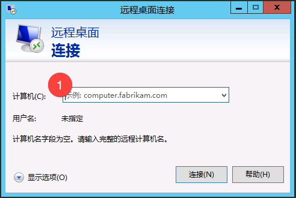
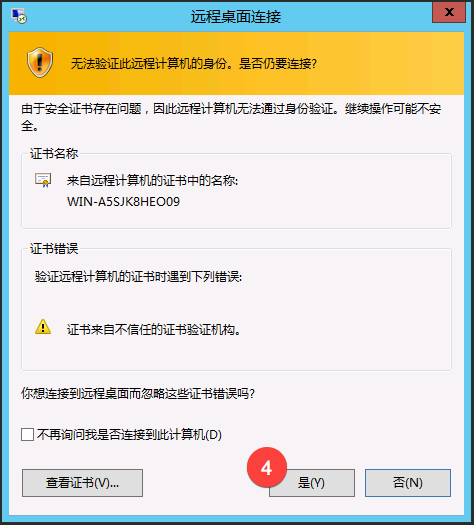

# 连接 Windows 实例

Note:
1.未绑定公网 IP 的实例，可以连接 [蜂巢 OpenVPN](../md.html#!容器服务/服务管理/使用技巧/如何使用蜂巢 OpenVPN.md) 后，使用内网 IP 登录；
2.为了方便大家使用，蜂巢官方镜像默认开启了远程桌面登录功能。出于安全考虑，特别是绑定公网 IP 的情况下，如非必须建议关闭该选项。

## 本地为 Windows 环境

这里以 Windows 10 为例，使用系统自带的 Mstsc 远程桌面连接：

### 1. 启动远程桌面连接

打开 「**开始菜单**」➡「**远程桌面连接**」；
或使用快捷键 「**Win + r**」启动「**运行**」窗口，输入「**mstsc**」回车启动远程桌面连接。

### 2. 登录 Windows 实例

2.1. 「**计算机名(C)**」输入实例公网或内网 IP（[查看实例 IP](../md.html#!容器服务/云主机/使用指南/网络/云主机查看绑定IP.md)）：

2.2. 输入用户名和密码，用户名默认 Administrator，密码为创建实例时设置的系统密码（并非 VNC 密码，[重置系统密码](../md.html#!容器服务/云主机/使用指南/密钥和密码/云主机-重置Windows密码.md)）；
2.3. 勾选「**记住我的凭据**」（未来免输密码）：

2.4. 忽略证书错误，点击「**是(Y)**」

## 本地为 Mac OS X 环境

下载并安装 Microsoft 远程桌面客户端，详见 [MSDN：在 Mac 上的远程桌面客户端入门](https://msdn.microsoft.com/zh-cn/library/dn473012)。