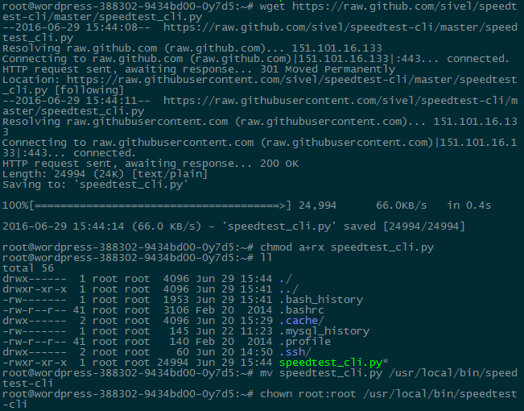
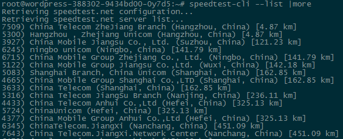

# 如何进行网络测试

## 简介

导致容器下行速度未达到设定速度或其他网络问题的原因很多，以下是一些常见原因：

* 创建容器时，忽略或者错误选择了容器带宽（默认 1 Mbps）；
* 终端用户下行带宽小于容器带宽；
* 区域性网络问题；

对于终端用户，我们建议使用 [Speedtest.net](http://www.speedtest.net/) 进行网络测试，以排除自身网络问题； 对于容器本身，我们建议使用 [speedtest-cli](https://github.com/sivel/speedtest-cli) 进行网络测试，以排除容器因素。

speedtest-cli 是一个使用 Python 编写的 Linux 命令行工具，在 Python 2.4 至 3.4 版本（CentOS 6、Debian 7、Ubuntu 12.04/14.04 等发行版本都默认包含了 Python 2.7.*）下均可运行，通过调用 Speedtest.net 测试上下行的接口来完成速度测试，可以放心使用。

Attention:
开始测试前，请核实创建容器时选择的带宽，这将直接影响网络测试结果。

## 下载 speedtest-cli
依次执行如下命令，下载 speedtest-cli 的 Python 脚本文件并赋予权限：

	wget https://raw.github.com/sivel/speedtest-cli/master/speedtest_cli.py
	chmod a+rx speedtest_cli.py
	mv speedtest_cli.py /usr/local/bin/speedtest-cli
	chown root:root /usr/local/bin/speedtest-cli

## 开始网络测试
使用 speedtest-cli 命令即可开始测试：

	speedtest-cli

开始测试后，将自动选择 Speedtest.net 服务器进行网络测试，并输出分配到的测试服务器以及上下行速度。

Attention:
请不要忽略创建容器时选择的带宽，这将直接影响使用体验和网络测试结果，你可以在容器设置界面直接在线调整容器带宽；
网易蜂巢机房位于浙江，若分配到的测试节点异常（比如分配到了深证节点)，请自定义测试服务器（我们建议使用 浙江电信 7905 服务器，见下文）。

## 自定义测试服务器
使用如下命令，可以根据物理距离列出所有 Speedtest.net 服务器：

	speedtest-cli --list |more

根据列表中每个服务器前的对应 ID（以下以浙江电信的服务器 7509 为例），通过如下命令使用指定的服务器进行网络测试：

	speedtest-cli --server 7509

## 使用MTR测试网络情况
以 Ubuntu 容器为例，在容器内执行如下命令，安装 MTR 测试工具

	apt-get install mtr -y

然后在容器内执行命令 <code>mtr 域名或IP</code> ，如

	mtr www.163.com

可以看到如下界面：

* 第一列:显示的是 IP 地址和域名；
* 第二列:显示的是每个对应 IP 的丢包率；
* 第三列:显示的是默认发送的数据包数目。
* 第四列:显示的最近一次的返回时延；
* 第五列:显示每次 Ping 的平均时延；
* 第六列:显示的是最短时延的；
* 第七列:显示的是最长延时；
* 第八列:是标准偏差；