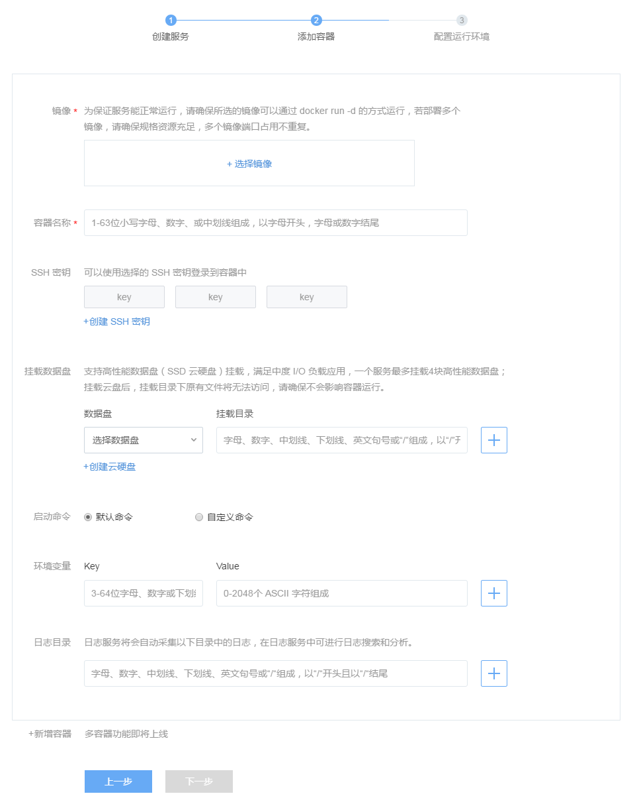

## 创建空间

点击左侧的导航菜单「服务管理」，进入服务管理页面，通过点击左侧空间列表左上角的「创建空间」按钮即可创建空间。

「空间」对应 Kubernetes 的 [Namespace](http://kubernetes.io/docs/user-guide/namespaces/)，使用空间可以将服务资源进行逻辑隔离，划分成不同的虚拟集群。例如，用户如果需要创建测试、联调、线上环境，可以通过空间来对这些环境进行隔离。

## 创建服务

点击服务列表左上角的「创建服务」按钮可进入创建服务页面。

* 「服务」对应 Kubernetes 的 [Service](http://kubernetes.io/docs/user-guide/services/)，用户通过<服务名称>:<服务端口>可以访问部署的服务 ，使用服务可以实现对应用的弹性伸缩、负载均衡、灰度升级、错误恢复。
* 「副本」对应 Kubernetes 的 [Pods](http://kubernetes.io/docs/user-guide/pods/)，是最小的部署单元和计费单位。一个副本根据应用场景，可以由一个或多个容器组成。当一个副本中有多个容器时，这些容器将会共享副本的计算资源、存储空间、IP和端口，对于计算资源还可以限制各个容器使用的比例。 对于无状态服务，副本随时可以删除和创建，当一个副本发生异常时，系统会删除该副本，然后再创建一个新的副本，从而维持了服务的副本数不变，实现错误弹性恢复，不影响服务的可用性。对于多个容器紧耦合的应用场景，比如主业务+数据采集的场景，可以使用单副本多容器的部署方案。

**服务分为有状态和无状态两种类型：**

* 有状态服务可以挂载数据盘，实现数据持久化，有状态服务仅可以拥有一个副本；
* 无状态服务则可以有多个副本，配合负载均衡使用，保证服务的可用性。

### 创建有状态服务

#### 添加容器

##### 选择镜像
可选择的镜像分为「我的镜像」、「蜂巢官方镜像」和「Docker Hub 镜像」。

「我的镜像」中包含用户自定义的镜像以及在蜂巢镜像中心收藏的镜像，**请注意在此选择您所需要的镜像版本**。其中，收藏的镜像左上角以星号标记。

##### 容器名称
填写容器名称，由 1~63 位小写字母、数字或中划线组成，以字母开头，字母或数字结尾。

##### 服务状态
选择「无状态」

##### 启动命令（高级设置内）
填写服务的启动命令即 dockerfile 内的 CMD 命令，默认执行服务内的启动命令，如遇容器无法启动（如创建服务时提示私有网IP绑定失败），可以选择自定义命令。常用自定义命令参考 Dockerfile 指令。

##### 环境变量（高级设置内）
你可在创建服务过程中，将所填环境变量注入到即将生成的容器中，这样可以避免常用环境变量的重复添加。

#### 配置运行环境
点击下一步，进入配置运行环境界面，如下图所示：

##### 服务名称
填写服务名称，由 1~63 位小写字母、数字或中划线组成，以字母开头，字母或数字结尾。

##### 规格
你可以选择合适自己项目的规格。

##### 端口配置
端口配置定义了容器和服务的端口映射关系，在容器端口填写进程监听的端口，在服务端口填写服务对外提供的端口。详见 如何进行端口配置。

##### 副本数
无状态服务支持多副本，副本配置定义了你的服务后端容器副本的个数，支持在线扩缩容。

#### 开始创建
配置完成后，点击「立即创建」按钮，调换至服务的「最近操作日志」页面，在此你可以查看构建的日志信息。

若遇到创建日志提示启动容器失败，请检查容器配置是否正确。请参考 启动容器失败FAQ。

### 创建有状态服务
#### 添加容器

##### 选择镜像
可选择的镜像分为「我的镜像」、「蜂巢官方镜像」和「Docker Hub 镜像」。

「我的镜像」中包含用户自定义的镜像以及在蜂巢镜像中心收藏的镜像，**请注意在此选择您所需要的镜像版本**。其中，收藏的镜像左上角以星号标记。

##### 容器名称
填写容器名称，由 1~63 位小写字母、数字或中划线组成，以字母开头，字母或数字结尾。

##### 服务状态
选择「有状态」

##### SSH 密钥
在创建容器的过程中，可选择 SSH 密钥（即公钥），选择的密钥在创建容器时会注入容器中。创建成功后，即可通过私钥进行 SSH 登录。**重要：出于安全考虑，蜂巢不提供采用密码登录的方式，仅支持密钥登录。**

倘若使用原生 SSH 客户端登录，需在「创建容器」时，注入 SSH 密钥；否则，可以选择创建密钥。

* 注入已有密钥 「添加容器」时，选择已有 SSH 密钥：
	* 创建容器时，最多支持注入五个密钥；
	* 容器创建成功后，出于安全考虑，不支持在「容器设置」页直接修改密钥。
* 创建密钥 点击「创建密钥」，蜂巢提供两种创建 SSH 密钥方式：

	* 创建新密钥：选择「创建新密钥」，蜂巢生成随机密钥，自动下载至本地；
	* 导入密钥：选择「导入密钥」，上传本地公钥文件或填写公钥内容导入本地密钥。

更详细的 SSH 密钥操作指南请参见 如何使用 SSH 密钥登录。

##### 云硬盘
点击选择数据盘下拉框,选择需要挂载的数据盘,在挂载目录中填写需要挂载到的路径。云硬盘不支持同时挂载到多个服务中。未创建云硬盘可以在当前界面创建云硬盘，详见 创建云硬盘。

##### 启动命令（高级设置内）
填写服务的启动命令即 dockerfile 内的 CMD 命令，默认执行服务内的启动命令，如遇容器无法启动（如创建服务时提示私有网IP绑定失败），可以选择自定义命令。常用自定义命令参考 Dockerfile 指令。

##### 环境变量（高级设置内）
你可在创建服务过程中，将所填环境变量注入到即将生成的容器中，这样可以避免常用环境变量的重复添加。

#### 配置运行环境
点击下一步，进入配置运行环境界面，如下图所示：

##### 服务名称
填写服务名称，由 1~63 位小写字母、数字或中划线组成，以字母开头，字母或数字结尾。

##### 规格
你可以选择合适自己项目的规格。

##### 端口配置
端口配置定义了容器和服务的端口映射关系，在容器端口填写进程监听的端口，在服务端口填写服务对外提供的端口。详见 如何进行端口配置。

##### 公网
公网可选择使用或者不使用。使用的情况下又可分为按带宽计费或按流量计费，你可以根据需要灵活配置，按需选择。

##### 副本数
有状态服务仅可以拥有一个副本。

#### 开始创建
配置完成后，点击「立即创建」按钮，调换至服务的「最近操作日志」页面，在此你可以查看构建的日志信息。

若遇到创建日志提示启动容器失败，请检查容器配置是否正确。请参考 启动容器失败FAQ。