# 如何进行持续集成

Attention:
着重注意文档中 Attention 部分，否则可能出现搭建失败的情况

## 持续集成概念
持续集成能够帮助开发者快速适应不断变化的需求和保证软件的质量。
使用容器技术，持续集成变得更简单。
本文将以 gihub 为例介绍如何在蜂巢中使用 jenkins 快速搭建自己的测试持续集成环境。

## 使用场景
当发生 push 操作时，能够触发测试环境的持续集成。

## 步骤

### 搭建 master 节点
蜂巢在官方 jenkins 镜像的基础上预先安装了 jenkins 的插件并预置了用户 (jenkins/jenkins)，[master 镜像地址](docker pull hub.c.163.com/netease_comb/jenkins-master-full:2.9.3)
节点分为 master 节点和 slave 节点，Master/Slave 相当于 Server 和 Agent 的概念，Master 节点提供 web 接口来让用户管理 job 和 slave，job 可以运行在 master 本机也可以被分配到 slave 上运行。一个 master 可以关联多个 slave 来为不同的 job 或相同的 job 的的不同配置来服务。即 master 作为管理角色，slave 执行构建工作。

####收藏镜像

在镜像仓库的镜像中心中搜索"jenkins-master-full"，找到对应镜像后收藏此镜像，如图:

#### 创建空间

为区别于其他服务建议在蜂巢中新建一个空间，如 ci，如下图所示:

#### 创建 master 节点

在空间 ci 下创建 jenkins master 服务。推荐使用有状态服务，使用有状态服务的优点如下:
* 有状态服务有外网 IP，外网 IP 可以用于 github 添加 webhook，
* 有状态服务可以挂在云硬盘，挂在云硬盘可以保证 jenkins 的数据不丢失。

创建服务，服务名称为 master，服务状态选择有状态，如图:

点击下一步，镜像选择上面收藏的镜像，版本选择 2.9.3，如图:

容器名称可以为"master"。
SSH 密钥部分不用操作，不建议新建密钥，不建议选择已经有的密钥。
挂载数据盘部分选择新建云硬盘，可以命名为 master，如图:

挂载目录填写/var/jenkins_home/，挂载到这个路径的原因是 jenkins 的配置信息在路径/var/jenkins/下，这样 jenkins 的配置数据便存储在了云硬盘中，后期需要重新建 master 节点时直接将之前的云硬盘 master 挂载到路径/var/jenkins/即可，这样 jenkins 不需要再进行重新配置。

启动命令选择默认命令。
环境变量和日志目录可以根据自己需要进行填写。
点击下一步，根据自己需要配置计费方式、规格、端口配置，确认配置信息后点击立即创建即可开始 master 服务的创建。

Attention:
如果使用的是自己私网搭建的 github，需要确保搭建的 github 和 jenkins master 之间的网络连通。
如果是自己制作的镜像，建议不要将 Dockerfile 中配置的卷的挂载路径和云硬盘的挂载路径重合。

### 搭建 slave 节点

#### 收藏镜像

slave 镜像目前提供 java 和 python 两种环境，本文档以 python 为例进行描述。
在镜像中心中搜索 jenkins-python-slave，收藏镜像，如图:

#### 新建 slave 服务

在空间 ci 中新建有状态服务 slave，如图:

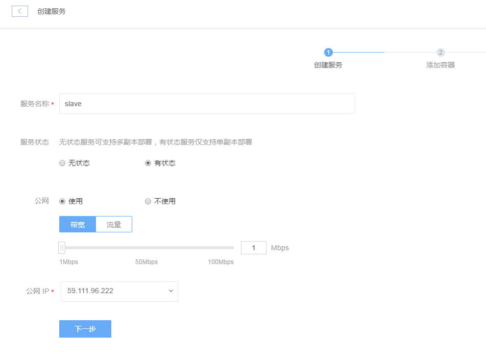

点击「下一步」,镜像选择上一步中收藏的镜像，版本选择 1.3，容器名称 slave，此处不建议创建密钥或者选择已经存在的密钥，创建云硬盘部分可以选择新建云硬盘并填写要挂载的目录。
点击「高级设置」，此处需要添加两个环境变量，JNLP_CRENDIENTIALS  jenkins:jenkins 和 JNLP_URL             http://masterIP:8080/computer/slave/slave-agent.jnlp 其中 masterIP 填写 master 服务的 IP 地址，slave 为 slave 节点的名称，需要与 jenkins 中新建的从节点名称一致，如图:
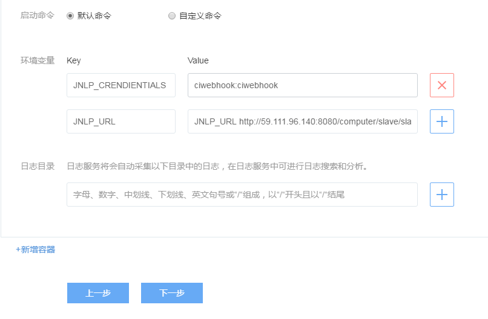

点击「下一步」，根据需要选择计费方式、规格，端口配置完成后点击「立即创建」开始 slave 服务的创建。

Attention:
环境变量 JNLP_CRENDIENTIALS 和 JNLP_URL 必须注入，否则 slave 服务会失败。
环境变量的 key 和 value 两侧可能会存在空格，需要删除空格。

### 配置 master、slave 免密码登录

#### slave 节点生成密钥

在 slave 节点中输入如下命令生成密钥:
<pre><code>
ssh-keygen
</code></pre>

#### master 节点生成密钥
在 master 节点中输入如下命令生成密钥:
<pre><code>
ssh-keygen
</code></pre>

#### 配置 master 免密码登录 slave
将 master 中文件/root/.ssh/id_rsa.pub 内容拷贝至 slave 节点的/root/.ssh/authorized_keys 文件中。

Attention:
在 Console 中直接拷贝 master 公钥并粘贴到 slave 时拷贝的公钥每行结尾会存在空格，需要将每行的空格删除，否则免密码配置会失败。

免密码登录配置完成之后在 master 节点上测试免密码登录至 slave 节点，如图:

### 配置 jenkins

#### 修改 jenkins 默认密码

用户 jenkins 为管理员，默认拥有全部权限，默认的用户名和密码皆为 jenkins，建议用户新建完 master 节点后修改默认的密码。
登录 jenkins,访问地址为 master 公网 ip:8080,如图:

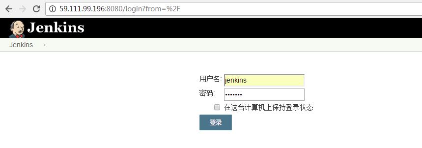

填写默认的用户名和密码，登录，点击系统管理，如图:

点击「管理用户」，如图:
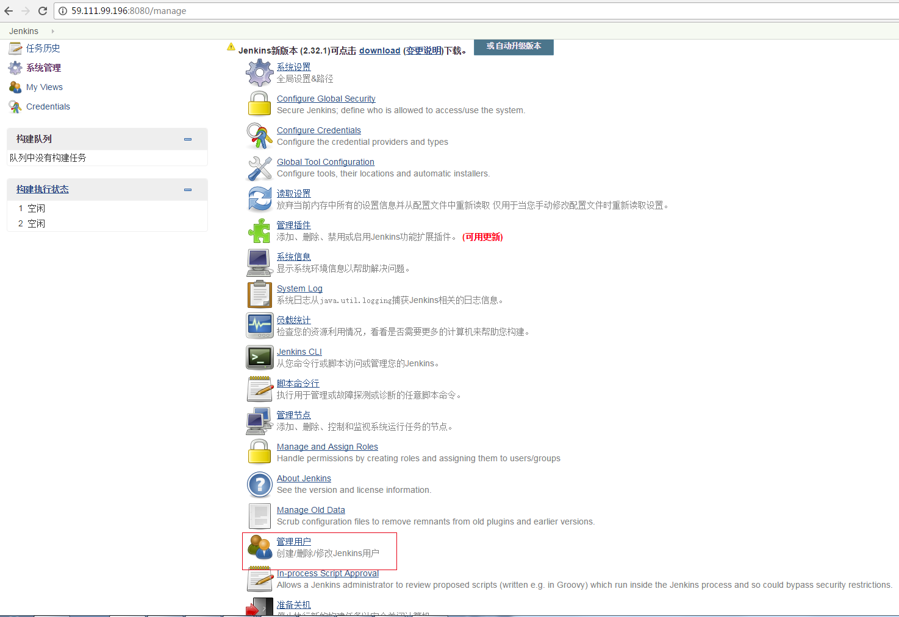

点击设置图标进入用户信息配置页面，如图:

进入用户信息配置页面后在「密码」部分进行密码的修改，如图:

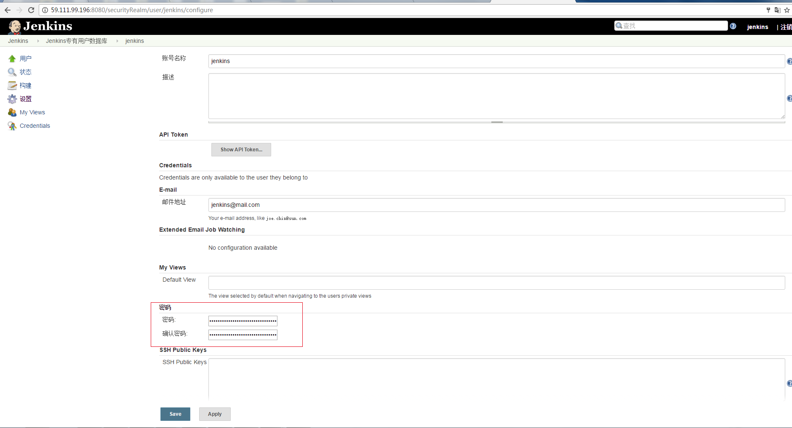

#### 创建用于 webhook 的用户
鉴于用户 jenkins 为管理员权限，推荐新建一个专门用于 webhook 回调的用户，如 ciwebhook。
点击 jenkins 首页面中「系统管理」，进入系统管理页面后点击「管理用户」，点击「新建用户」，填写用户信息，如下图:
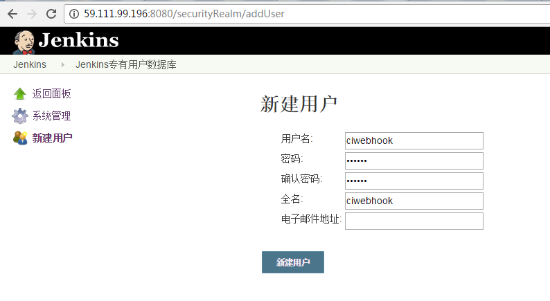

点击「系统管理」，在系统管理页面点击「Manage and Assign Roles」，如下图:

点击「Manage Roles」，如下图:
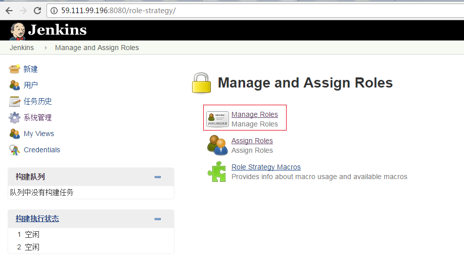

增加 ciwebhook 角色，并赋予 overall read 权限，如图:

点击「apply」和「save」之后点击「Assign Roles」，如图:

进入 Assign Roles 界面，为用户赋予 ciwebhook 角色，如图:

点击「Apply」和「Save」

####添加证书

将 slave 节点的私钥文件 id_rsa 拷贝至 master 节点某个路径下，如/home/jenkins/。
jenkins 首页面中点击「Credentials」,如图:

点击「global」进入如下界面:

点击「Add Credentials」进入证书信息配置页面，如图:
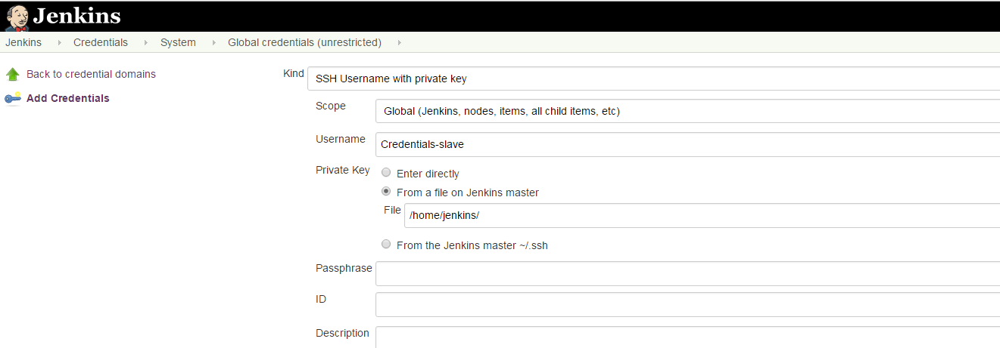

Kind 选择“SSH Username with private key”，username 为证书名字，File 填写上面拷到 master 节点上 id_rsa 文件，点击「save」完成证书添加。

#### 创建子节点

在 jenkins 首页面点击「系统管理」后点击「管理节点」，如图:

填写节点名称，如 slave，如图:

点击「OK」进入节点信息配置页面，填写配置信息，如图:

点击「save」从节点新建完成，如图:

### 新建任务

在 jenkins 首页面点击「新建」，填写任务名字，如 test1，任务类型选择"Pipeline"，点击「OK」，进入任务配置页面，如图:

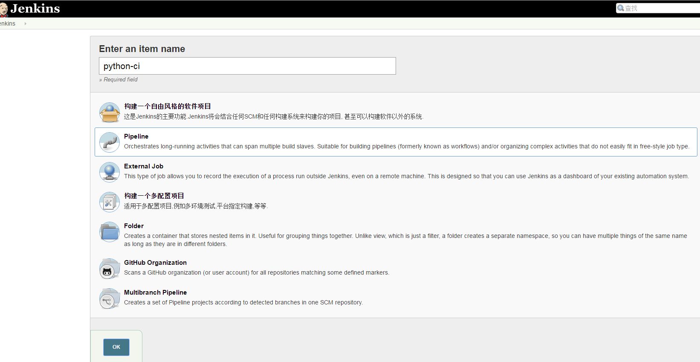
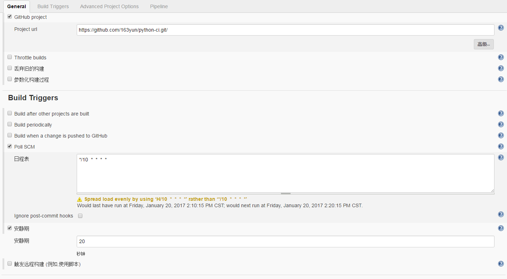

项目名称 test1，选择"GitHub project"，Project url 此处为"https://github.com/929121806/test1.git/"。
Build Triggers 选择"Poll SCM"，即周期性检查是否有 push 操作，如有则触发构建，日程表中填写检查周期，本例中为 5 分钟检查一次，安静期设置为 20 秒。
Pipeline 部分中 Difinition 选择"Pipeline script from SCM"，SCM 选择"Git"，	Repository URL 填写项目的地址，如"https://github.com/929121806/test1.git"，	Credentials 选择之前新建的"jenkins"证书，Branch Specifier (blank for 'any') 选择要 push 的分支，	Script Path 填写 Jenkinsfile 文件的路径，此时任务新建完成。

Attention:
建议设置安静期，否则当多个 slave pull 代码时可能会发生冲突

### 镜像仓库配置

#### 新建镜像仓库

仓库名称为 test1，持续集成选择"支持"，访问权限选择"私有"，此处必须选择为私有，如图：

点击"立即创建"。

镜像仓库新建完成后进入构建镜像页面，如图:

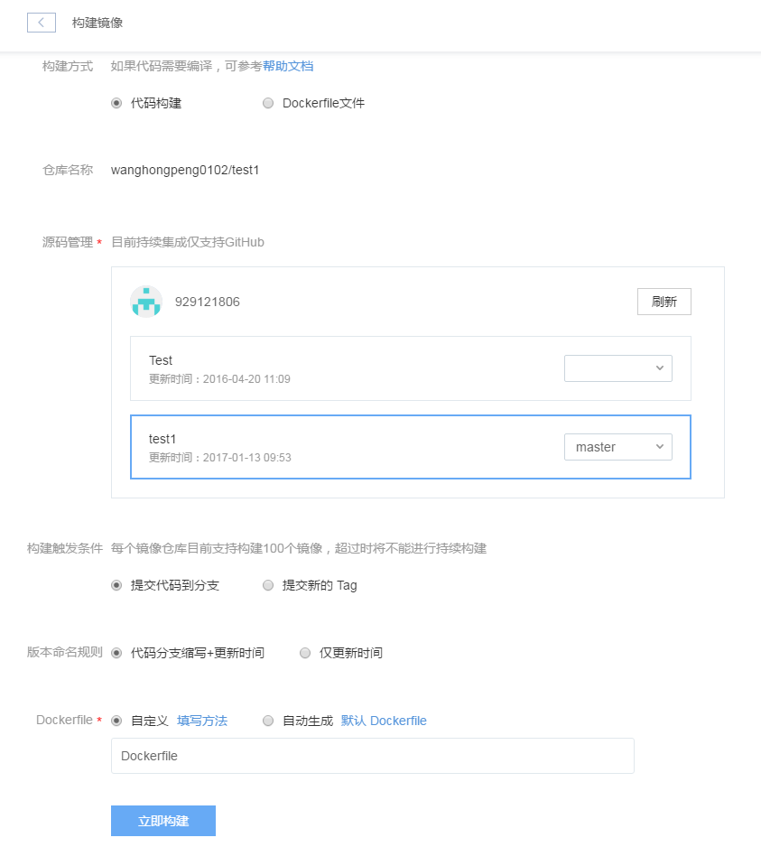

选择"代码构建"，源码管理部分需要进行 github 账号的认证，选择项目名称和分支，构建触发条件选择"提交代码到分支"，这样当提交代码到指定的分支后会自动触发 Jenkins 构建，Dockerfile 中填写 Dockerfile 文件在 github 工程中的路径。
点击「立即创建」完成构建镜像的配置。

### 测试
修改工程信息，向 github 进行 push 操作，此时会触发在 slave 节点上的自动构建，如图:

从 console output 可以查看构建过程输出的日志，如图:

### 示例项目解释

github 中包含一个简单的示例项目 test1，包含文件 Dockerfile、Jenkinsfile、main.py、test.py、service.sh。启动 service.sh 完成服务的新建操作，main.py 为项目程序，test.py 为测试程序。服务新建成功后输出服务的 id，否则会报错，main.py 会在/root/新建一个文件 a.log，新建成功后 test.py 输出"OK，文件新建成功"，否则输出"文件新建失败"，如图:

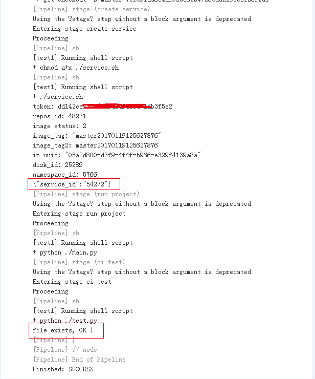

