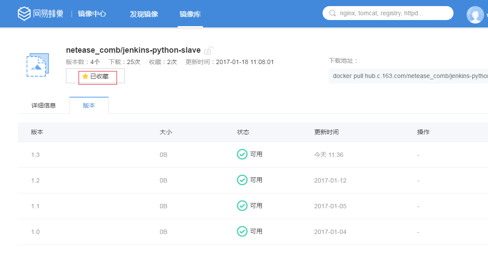
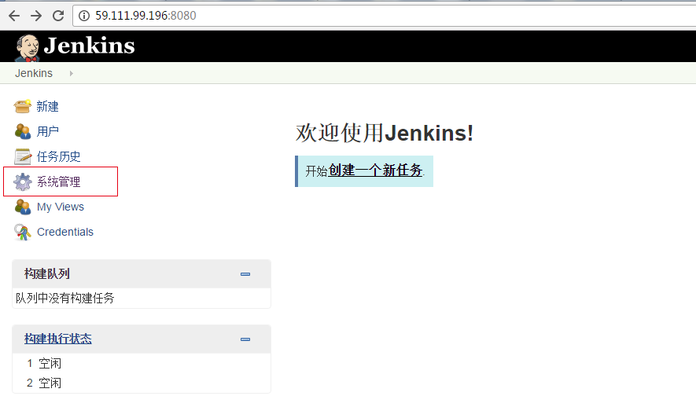
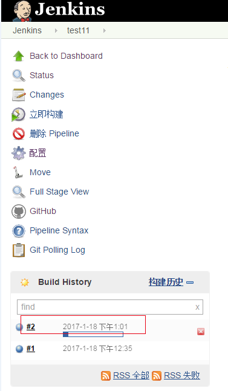
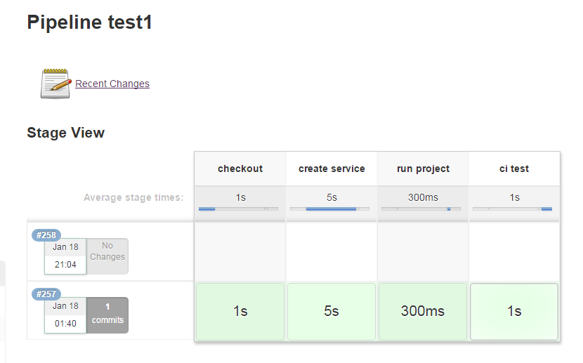
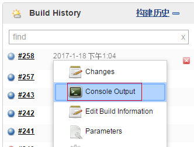

# 如何进行持续集成

Attention:
着重注意文档中Attention部分，否则可能出现搭建失败的情况。

## 持续集成概念

持续集成能够帮助开发者快速适应不断变化的需求和保证软件的质量。
使用容器技术，持续集成变得更简单。
本文将以gihub为例介绍如何在蜂巢中使用jenkins快速搭建自己的测试持续集成环境。

## 使用场景
当发生push操作时，能够触发测试环境的持续集成。

## 步骤

### 搭建master节点
蜂巢在官方jenkins镜像的基础上预先安装了jenkins的插件并预置了用户(jenkins/jenkins)，[master镜像地址](docker pull hub.c.163.com/netease_comb/jenkins-master-full:2.9.3)
节点分为master节点和slave节点，Master/Slave相当于Server和Agent的概念，Master节点提供web接口来让用户管理job和slave，job可以运行在master本机也可以被分配到slave上运行。一个master可以关联多个slave来为不同的job或相同的job的的不同配置来服务。即master作为管理角色，slave执行构建工作。

####收藏镜像

在镜像仓库的镜像中心中搜索"jenkins-master-full"，找到对应镜像后收藏此镜像，如图:

#### 创建空间

为区别于其他服务建议在蜂巢中新建一个空间，如ci，如下图所示:

#### 创建master节点

在空间ci下创建jenkins master服务。推荐使用有状态服务，使用有状态服务的优点如下:
* 有状态服务有外网IP，外网IP可以用于github添加webhook，
* 有状态服务可以挂在云硬盘，挂在云硬盘可以保证jenkins的数据不丢失。

创建服务，服务名称为master，服务状态选择有状态，如图:

点击下一步，镜像选择上面收藏的镜像，版本选择2.9.3，如图:

容器名称可以为"master"。
SSH密钥部分不用操作，不建议新建密钥，不建议选择已经有的密钥。
挂载数据盘部分选择新建云硬盘，可以命名为master，如图:

挂载目录填写/var/jenkins_home/，挂载到这个路径的原因是jenkins的配置信息在路径/var/jenkins/下，这样jenkins的配置数据便存储在了云硬盘中，后期需要重新建master节点时直接将之前的云硬盘master挂载到路径/var/jenkins/即可，这样jenkins不需要再进行重新配置。

启动命令选择默认命令。
环境变量和日志目录可以根据自己需要进行填写。
点击下一步，根据自己需要配置计费方式、规格、端口配置，确认配置信息后点击立即创建即可开始master服务的创建。

Attention:
如果使用的是自己私网搭建的github，需要确保搭建的github和jenkins master之间的网络连通。
如果是自己制作的镜像，建议不要将Dockerfile中配置的卷的挂载路径和云硬盘的挂载路径重合。

### 搭建slave节点

#### 收藏镜像

slave镜像目前提供java和python两种环境，本文档以python为例进行描述。
在镜像中心中搜索jenkins-python-slave，收藏镜像，如图:

#### 新建slave服务

在空间ci中新建有状态服务slave，如图:

点击「下一步」,镜像选择上一步中收藏的镜像，版本选择1.3，容器名称slave，此处不建议创建密钥或者选择已经存在的密钥，创建云硬盘部分可以选择新建云硬盘并填写要挂载的目录。
点击「高级设置」，此处需要添加两个环境变量，JNLP_CRENDIENTIALS  jenkins:jenkins 和JNLP_URL             http://masterIP:8080/computer/slave/slave-agent.jnlp 其中masterIP填写master服务的IP地址，slave为slave节点的名称，需要与jenkins中新建的从节点名称一致，如图:

点击「下一步」，根据需要选择计费方式、规格，端口配置完成后点击「立即创建」开始slave服务的创建。

Attention:
环境变量JNLP_CRENDIENTIALS 和JNLP_URL必须注入，否则slave服务会失败。
环境变量的key和value两侧可能会存在空格，需要删除空格。

### 配置master、slave免密码登录

#### slave生成密钥

在slave节点中输入如下命令生成密钥:
<pre><code>
ssh-keygen
</code></pre>

#### master节点生成密钥
在master节点中输入如下命令生成密钥:
<pre><code>
ssh-keygen
</code></pre>

#### 配置master免密码登录slave
将master中文件/root/.ssh/id_rsa.pub内容拷贝至slave节点的/root/.ssh/authorized_keys文件中。

Attention:
在Console中直接拷贝master公钥并粘贴到slave时拷贝的公钥每行结尾会存在空格，需要将每行的空格删除，否则免密码配置会失败。

免密码登录配置完成之后在master节点上测试免密码登录至slave节点，如图:

### 配置jenkins

#### 修改jenkins默认密码

用户jenkins为管理员，默认拥有全部权限，默认的用户名和密码皆为jenkins，建议用户新建完master节点后修改默认的密码。
登录jenkins,访问地址为 master公网ip:8080,如图:

填写默认的用户名和密码，登录，点击系统管理，如图:

点击「管理用户」，如图:

点击设置图标进入用户信息配置页面，如图:

进入用户信息配置页面后在「密码」部分进行密码的修改，如图:

#### 创建用于webhook的用户
鉴于用户jenkins为管理员权限，推荐新建一个专门用于webhook回调的用户，如ciwebhook。
点击jenkins首页面中「系统管理」，进入系统管理页面后点击「管理用户」，点击「新建用户」，填写用户信息，如下图:

点击「系统管理」，在系统管理页面点击「Manage and Assign Roles」，如下图:

点击「Manage Roles」，如下图:

增加ciwebhook角色，并赋予overall read权限，如图:

点击「apply」和「save」之后点击「Assign Roles」，如图:

进入Assign Roles界面，为用户赋予ciwebhook角色，如图:

点击「Apply」和「Save」

####添加证书

将slave节点的私钥文件id_rsa拷贝至master节点某个路径下，如/home/jenkins/。
jenkins首页面中点击「Credentials」,如图:

点击「global」进入如下界面:

点击「Add Credentials」进入证书信息配置页面，如图:

Kind选择“SSH Username with private key”，username为证书名字，File填写上面拷到master节点上id_rsa文件，点击「save」完成证书添加。

#### 创建子节点

在jenkins首页面点击「系统管理」后点击「管理节点」，如图:

填写节点名称，如slave，如图:

点击「OK」进入节点信息配置页面，填写配置信息，如图:

点击「save」从节点新建完成，如图:

### 新建任务

在jenkins首页面点击「新建」，填写任务名字，如test1，任务类型选择"Pipeline"，点击「OK」，进入任务配置页面，如图:

项目名称test1，选择"GitHub project"，Project url此处为"https://github.com/929121806/test1.git/"。
Build Triggers选择"Poll SCM"，即周期性检查是否有push操作，如有则触发构建，日程表中填写检查周期，本例中为5分钟检查一次，安静期设置为20秒。
Pipeline部分中Difinition选择"Pipeline script from SCM"，SCM选择"Git"，	Repository URL填写项目的地址，如"https://github.com/929121806/test1.git"，	Credentials选择之前新建的"jenkins"证书，Branch Specifier (blank for 'any')选择要push的分支，	Script Path填写Jenkinsfile文件的路径，此时任务新建完成。

Attention:
建议设置安静期，否则当多个slave pull代码时可能会发生冲突

### 镜像仓库配置

#### 新建镜像仓库

仓库名称为test1，持续集成选择"支持"，访问权限选择"私有"，此处必须选择为私有，如图：

点击"立即创建"。

镜像仓库新建完成后进入构建镜像页面，如图:

选择"代码构建"，源码管理部分需要进行github账号的认证，选择项目名称和分支，构建触发条件选择"提交代码到分支"，这样当提交代码到指定的分支后会自动触发Jenkins构建，Dockerfile中填写Dockerfile文件在github工程中的路径。
点击「立即创建」完成构建镜像的配置。

### 测试
修改工程信息，向github进行push操作，此时会触发在slave节点上的自动构建，如图:

从console output可以查看构建过程输出的日志，如图:

### 示例项目解释

github中包含一个简单的示例项目test1，包含文件Dockerfile、Jenkinsfile、main.py、test.py、service.sh。启动service.sh完成服务的新建操作，main.py为项目程序，test.py为测试程序。服务新建成功后输出服务的id，否则会报错，main.py会在/root/新建一个文件a.log，新建成功后test.py输出"OK，文件新建成功"，否则输出"文件新建失败"，如图:

