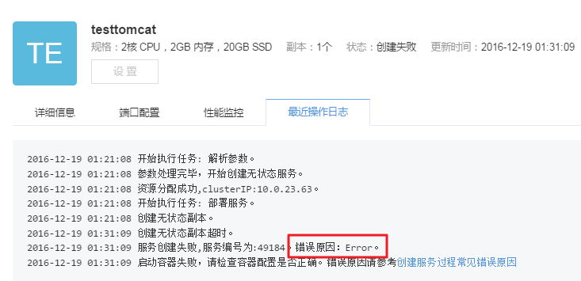

# 启动容器失败 FAQ

若遇到服务创建失败的情况，你可以在服务详情内的「最近操作日志」标签下看到错误原因：

你可以根据上图红框内的错误原因，结合以下内容进行排障：

#### ContainerCannotRun
错误场景：

* 自定义命令找不到， 如：`oci runtime error: exec: \"/bin/xxx\": stat /bin/xxx: no such file or directory"`；
* 设置了错误的 CMD/ENTRYPOINT 命令；
* 数据盘挂载到系统路径或日志目录设置错误，导致系统无法正常运行。

#### Completed
错误场景：

* 容器一启动就退出，如：使用了 `bash` 等交互式启动命令。

#### Error
错误场景：

* 没有设置镜像运行所需的环境变量，如：未设置 mysql 运行所需的密码

		database is uninitialized and password option is not specified 
		You need to specify one of MYSQL_ROOT_PASSWORD, MYSQL_ALLOW_EMPTY_PASSWORD and MYSQL_RANDOM_ROOT_PASSWORD

* 服务启动使用的配置文件问题，如：nginx.conf 格式不合法。

#### OOMKilled
错误场景：

* 容器的内存使用超过预设的阈值或者阈值设置过小。

#### ImagePullBackOff
错误场景：

* 启动前拉取容器镜像失败。如：`Back-off pulling image \"hub.c.163.com/zhouss/asdfasdf:latest\`

## 建议：
* 阅读镜像的说明文件（官方镜像在镜像中心均有说明），了解镜像的使用方法；
* 将镜像拉取到本地 Docker 环境，检查是否可以通过 `docker run -d <镜像名称>` 命令运行；
* 正确设定容器启动时具体的执行命令，详见 [Dockerfile指令](http://support.c.163.com/md.html#!容器服务/服务管理/使用指南/如何自定义服务启动命令.md)；
* 错误场景仅供参考，若依然无法定位具体问题，请提交工单联系我们。