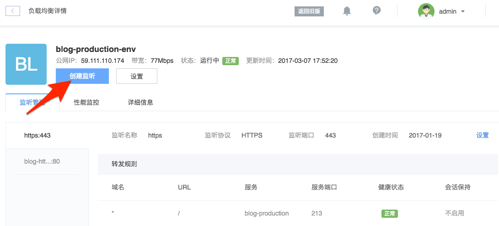
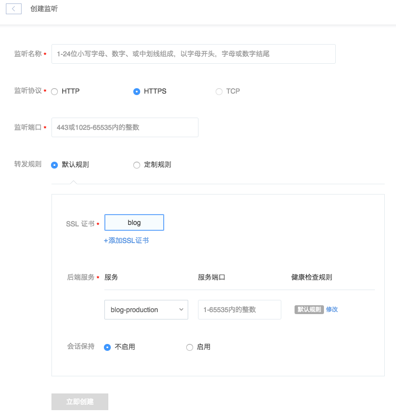

# 创建监听

在负载均衡列表点击需要添加监听的负载均衡名称，进入负载均衡详情页，再点击「创建监听」按钮即可：

Note:
默认单个实例监听上限为 20 组，如果需要更多监听，请 [提交工单申请](https://c.163.com/dashboard#/m/ticket/create/?type=%E8%B4%9F%E8%BD%BD%E5%9D%87%E8%A1%A1)

## 监听协议
目前支持 HTTP 、HTTPS 和 TCP 协议，使用 HTTPS 协议，需在下方 添加 SSL 证书。

* 你可以在蜂巢申请免费的 DV 证书用户实现 https，详见：[如何申请 SSL 证书](http://support.c.163.com/md.html#!平台服务/SSL证书管理/使用指南/申请SSL证书.md)
* 也可以添加本地 SSL 证书

## 监听端口
* HTTP 使用 80 或 1025 - 65535 内数字
* HTTPS 使用 443 或 1025 - 65535 内数字
* TCP 使用 1 - 65535 内数字

## 转发规则

### 默认规则
默认转发所有请求。

* 后端服务：创建负载均衡时选择的空间内的后端服务。
	* 服务端口：后端服务必须添加该端口配置
	* 健康检查：详见 [配置健康检查](http://support.c.163.com/md.html#!容器服务/负载均衡/运维指南/配置负载均衡健康检查.md)
* 会话保持：可以选择「不启用」或「启用」，默认为「不启用」。启用会话保持可以「植入 Cookie」或「改写 Cookie」：
	* 植入 Cookie：负载均衡服务自动生成 cookie，可以指定超时时间，单位为 S。不填则默认为会话 Cookie
	* 改写 Cookie：改写用户指明的 cookie，如果没有对应 Cookie 说明不使用会话保持

### 定制规则

Note:
目前使用定制规则，请先添加一条域名为「*」，URL为「/」的通配规则。

#### 域名
每组监听可以设置多个域名，域名支持完整域名和通配符。

* 长度最大 512 个字符
* 可添加多个，由空格分隔, 如 `a.com b.com c.com`
* 其中每一项包含字符必须是：数字，字母，`_`（下划线），`-` (横线)，`.`（点）或者通配符（`*.` 或`.*`）
* 通配符 `*.` 必须在开头，`.*` 必须在结尾。

以 c.163.com 为例，格式如下所示：

* c.163.com 精确匹配 c.163.com 域名
* *.163.com 匹配所有以 163.com 结尾的域名
* c.163.* 匹配所有以 c.163 开始的域名

Attention:
如果开启了域名匹配，但请求的域名匹配不到任意一条规则，会返回 403。

#### URL 配置
* 长度最大 128 个字符
* 可添加多个url，由空格分隔, 如 `/a /b /c`
* URL 必须以 `/` 开头
* 除 `/` 外，包含字符必须是字母，数字
* 不能以 `/` 结尾
* 可支持多级 URL，如 `/news/social`
* 使用前缀匹配，支持 `/`，可以在最后加入 `$` 来做完整匹配
* 健康检查：详见 [配置健康检查](http://support.c.163.com/md.html#!容器服务/负载均衡/运维指南/配置负载均衡健康检查.md)
