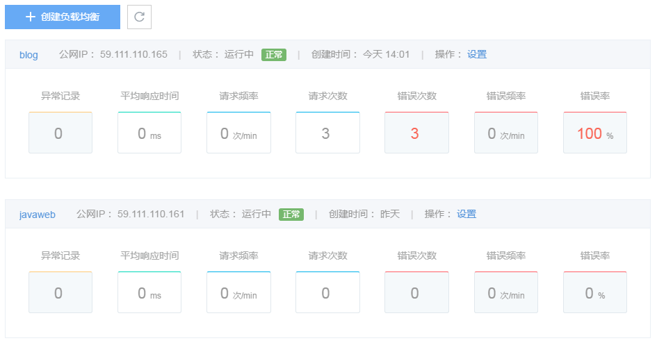
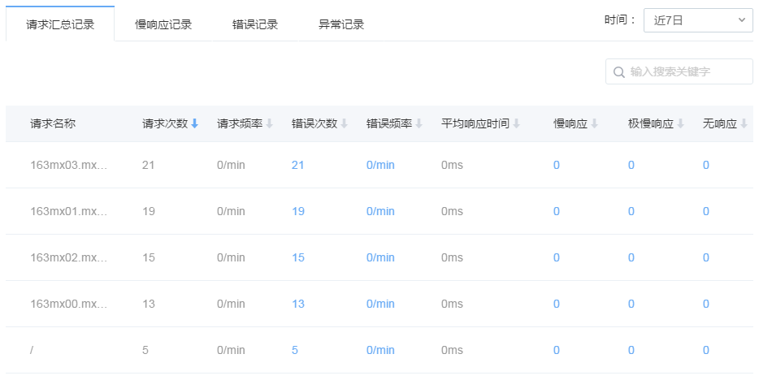

# 监控负载均衡

点击左侧的导航菜单「负载均衡」，即可查看所有负载均衡监控信息：

### 发现问题
性能监控通过探针的方式，分布式地采集服务运行数据，汇总到监控服务器。监控服务器记录、整理、分析性能数据，最后产生监控图表，展示给用户查看。

通过负载均衡列表仪表盘，你可以看到 30 分钟内的性能数据指标，这些指标包括：

* 异常记录：超出规定指标的数据将被记录到健康异常中。
* 平均响应时间：入口请求在观察周期内的平均响应时间。
* 请求频率、请求次数：入口请求在观察周期内的请求次数和频率（按分钟计）。
* 错误频率、错误次数、错误率：入口请求在观察周期内的错误次数和频率（按分钟计），以及错误次数与请求次数的比例。

### 定位问题
通过该图表，你可以快速判断系统是否出问题，以及问题的大致类型是什么。蜂巢还提供了丰富的明细图表和快照信息，帮助用你速定位问题，如下图所示：

通过明细图表,你可以看到：

* 每个访问的请求，具体的统计信息。
* 慢的请求、出错的请求、以及健康异常事件的记录。

如果需要进一步确定问题的原因，还可以使用快照功能。异常记录前面若有照相机图标，表示蜂巢记录了这次异常记录的快照信息。
