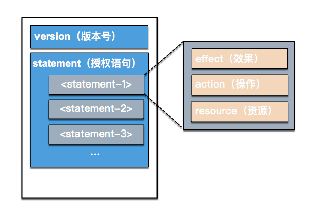

# 策略语言

网易蜂巢访问控制使用策略来描述授权的具体内容，本文将介绍策略语言的元素和正式语法，以便理解如何构造和验证策略。

## 基于 JSON

策略仅支持 JSON 格式表示，提交策略时将先验证 JSON 格式，若验证不通过也将给出提示。JSON 语法标准参见 [RFC 7159](http://tools.ietf.org/html/rfc7159)。

策略结构如下：

## 语法
### 语法约定

1. 以下字符是 JSON 字符，包含在策略中：
   `{ } [ ] " , :`
2. 以下字符是语法中的特殊字符，不包含在策略中：
   `= < > ( ) |`
3. 允许多个值时，只包含一个值也是有效的（只有一个值时）；如果元素采用数组（使用 [ 和 ] 标记）但只包含一个值，则括号也是必填。例如：
   `"action": [<action_string>]`
4. 多值之间用竖线（|）隔开，表示取值只能选取这些值中的某一个。比如：
  ` ("allow" | "deny")`
5. 使用双引号引起了的元素，表示它是文本串。例如：
   `<version_block> = "version" : "1"`

### 语法

	policy  = {
	     <version_block>,
	     <statement_block>
	}
	<version_block> = "version" : "1"
	<statement_block> = "statement" : [ <statement>, <statement>, ... ]
	<statement> = { 
	    <effect_block>,
	    <action_block>,
	    <resource_block>
	}
	<effect_block> = "effect" : ("allow" | "deny")  
	<action_block> = "action" : 
	    ("*" | [<action_string>, <action_string>, ...])
	<resource_block> = "resource" : 
	    ("*" | [<resource_string>, <resource_string>, ...])

### 语法说明
* 当前支持的策略版本为 1；
* 一个策略可以包含一组语句；
* 单个元素不能包含同一个键的多个实例。例如，不能在同一语句中包含两次 effect 块；
* 各 block 顺序无关紧要；
* 每条授权语句要么是 deny，要么是 allow。一条授权语句中，action 或 resource  是一个支持多个操作的列表；
* 每条授权语句都支持独立的限制条件。一个条件块可以支持多种条件操作类型，以及对这多种条件的逻辑组合；
* 一个群组可以被授予多条策略，当这些策略中既包含 allow 又包含 deny 时，我们遵循 deny 优先（只认 deny 不认 allow）原则；
* 当元素取值为字符串值时，支持 `*` 的前缀匹配。 `*` 可以代表任意个数字符。例如：`"comb:nos:*:*:*:blue*"`可以表示所有以 blue 开头的桶的名称。

## 元素

### version - 版本

Version 指定策略语言版本。必填且无法修改，修改策略内容后将自增。

### effect - 效果

effect 有效取值为 allow 或 deny。示例：

	"effect": "allow"

### action - 操作

action 是对具体资源的操作，支持多值。

**格式定义：**

	comb:<service-name>:<action-name>

**格式说明：**

* comb：代表网易蜂巢；
* service-name：蜂巢产品业务代号，如 rds、nos 等；
* action-name：操作接口名称，如 GetBucket、CreateDatabase 等（操作列表可以在各产品文档中找到）；
* 支持通配符前缀匹配，区分大小写。

**示例：**

	"action":[
	  "comb:nos:GetBucket",
	  "comb:nlb:GetLb"
	]

	"action":[
	  "comb:nos:Get*",
	  "comb:nlb:Get*"
	]

### resource -资源

resource 是被授权的具体资源对象，如 rds 实例，nos 桶等。

**格式定义：**

	comb:<service-name>:<region>:<az>:<account-id>:<relative-id>

**格式说明：**

* comb：代表网易蜂巢；
* service-name：蜂巢产品业务代号，如 rds、nos 等；
* region：地域，如果不支持该项，使用通配符 `*` 号来代替；
* az：可用域，如果不支持该项，使用通配符 `*` 号来代替；
* account-id: 账号 ID，目前使用通配符 `*` 号来代替；
* relative-id: 与 service 相关的资源描述部分，其语义由具体 service 指定，类似于文件路径的树状结构，比如 cdn 的 domain、rds 的 instance，支持使用通配符 `*` 号前缀匹配。

**示例：**

	"resource": [
	   "comb:cdn:*:*:*:domain/163.com"
	 ]

	"resource": [
	   "comb:nos:*:*:*:mybucket/home/*"
	 ]

