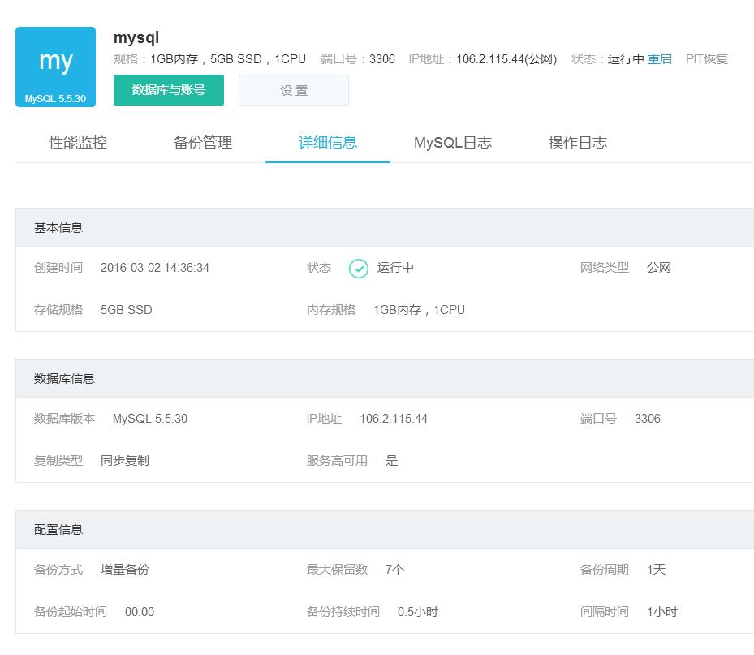
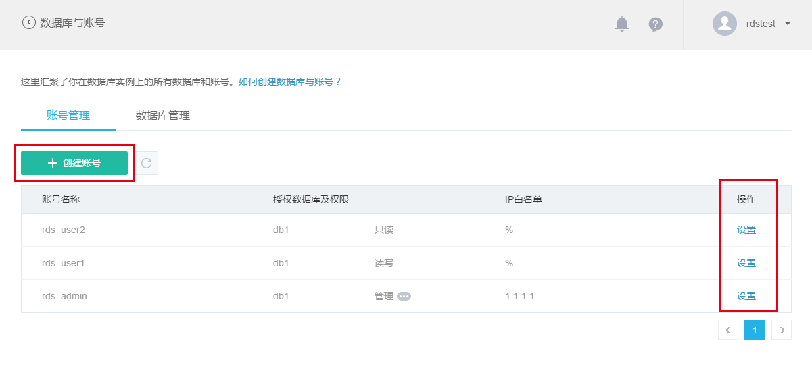
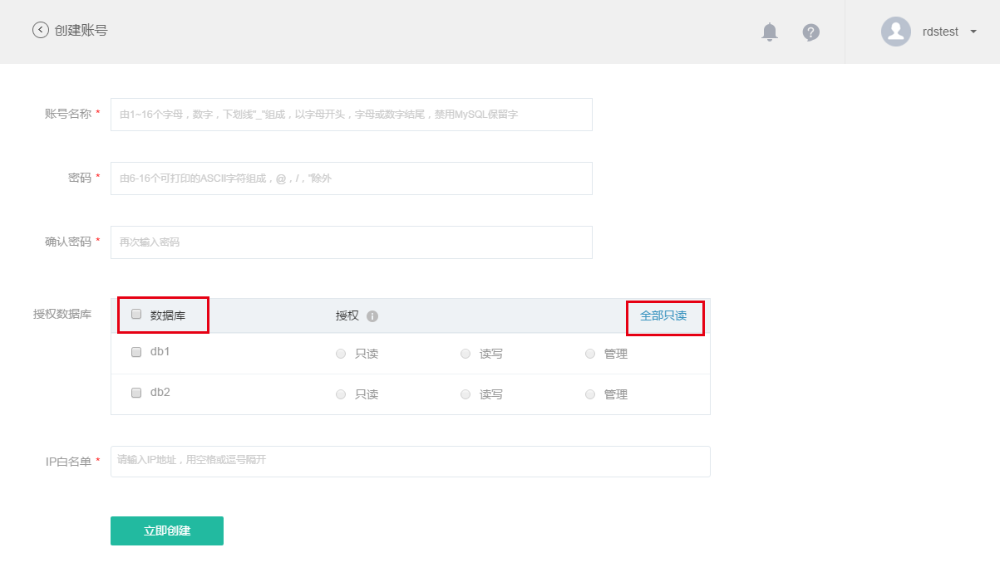
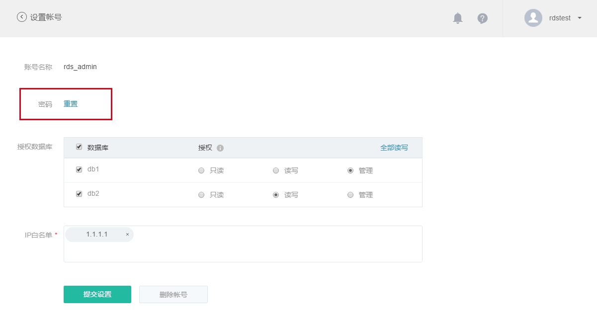
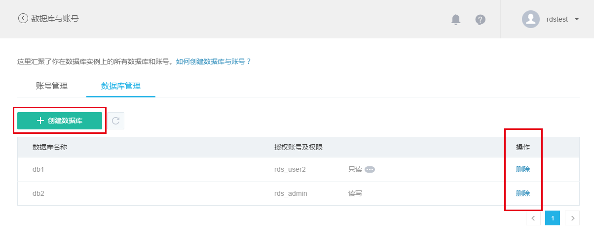
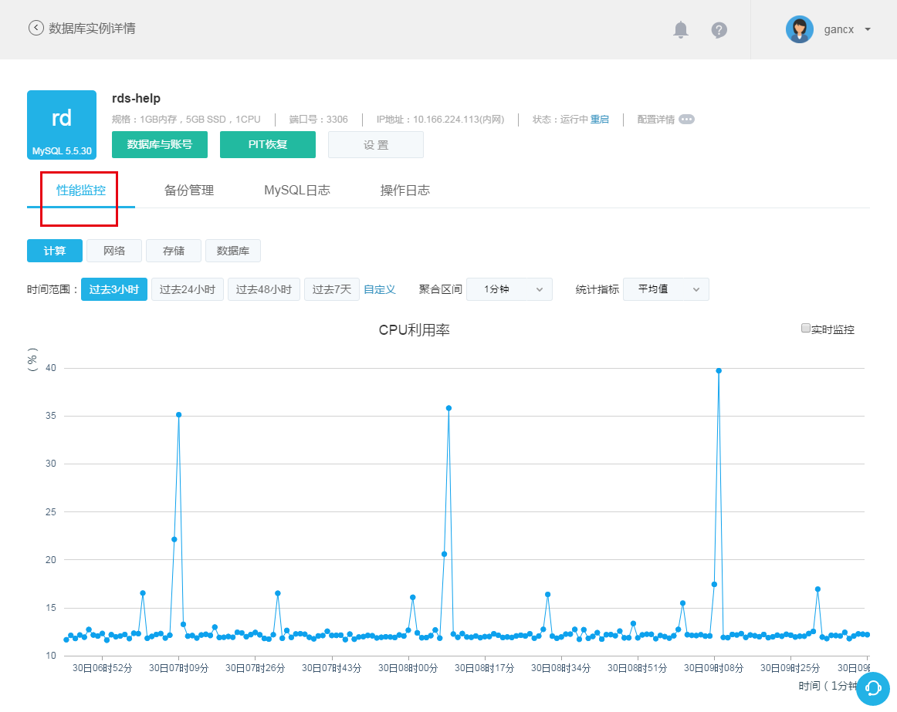
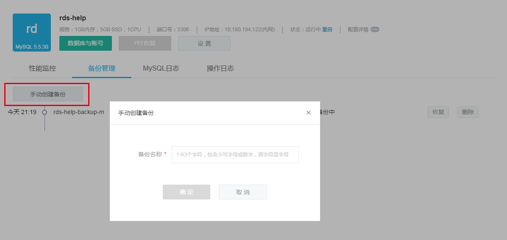
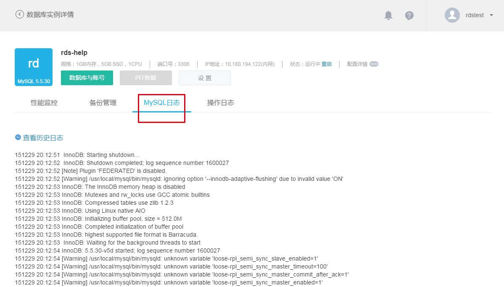
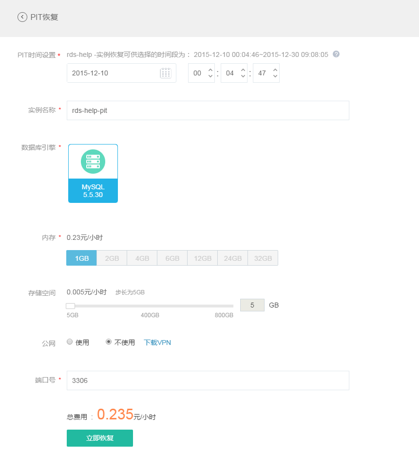

# RDS 实例管理

在数据库首页，点击「实例名称」进入该实例的详情页面。该页包含了实例的配置详情、监控数据、备份信息、日志文档，并提供数据库与账号管理、备份与恢复、PIT 恢复和实例重启等功能入口。

## 实例配置详情

实例的详情页面顶部展示了实例名称、数据库引擎版本、规格、网络配置和运行状态等基本信息。将鼠标移动至配置详情处，可查看安全组、复制类型、备份类型等更多配置信息。 

## 数据库与账号

在实例中创建数据库和账号，可以授权指定账号获得相应的数据库权限，从而通过账号链接和操作数据库。可以点击「数据库与账号」按钮，进入「数据库与账号」管理页面。页面包含了「账号管理」和「数据库管理」两部分，分别展示已创建的账号和数据库列表，包含授权和 IP 白名单信息，以及设置、删除功能入口。 

### 账号管理

账号管理页面展示已创建的账号列表，包含授权数据库及权限和 IP 白名单信息，提供创建和设置账号功能入口。 

点击「创建账号」按钮，进入创建账号页面。你可按照提示填写账号信息、授权数据库和IP白名单。在授权数据库时，可使用表头全选框和「全部只读」、「全部读写」按钮快速为数据库批量授权。点击「立即创建」按钮，即开始创建账号。 

对已存在的账号，在账号管理页面点击操作栏中的「设置」链接，可以进入设置账号页面，对授权数据库和 IP 白名单进行修改。点击密码「重置」，可以修改账号的密码。该页面同时提供账号删除功能，点击「删除账号」并确认，即可将账号删除。 

### 数据库管理

数据库管理页面展示已创建数据库的列表，包含授权账号及权限信息，提供创建和删除数据库功能入口。

点击「创建数据库」按钮，进入创建数据库页面。你可按照提示填写数据库名称、选择字符集和授权账号。在授权账号时，可使用表头全选框和「全部只读」、「全部读写」按钮快速为账号批量授权。点击「立即创建」按钮，即开始创建数据库。 

对已存在的数据库，在数据库管理页面点击操作栏中的「删除」并确认，即可删除指定数据库。

## 性能监控

在实例详情界面，点击「性能监控」标签进入到 RDS 实例性能监控界面。该页面展示了当前实例在计算、网络、存储和数据库层面的四大类共计三十种性能数据，提供五项统计指标供选择，并基于用户指定的时间范围，提供不同聚合区间和实时监控功能。 

**监控项**
本页面提供三十项监控数据的曲线图展示，详情如下：

| 类型	|监控项|
|--------------|----|
|计算	|CPU 利用率、内存利用率、系统盘利用率、占用内存量|
|网络	|网络流出带宽、网络流入带宽|
|存储	|磁盘空间利用率、磁盘 IO、磁盘利用率、占用磁盘存储空间、磁盘写入次数、磁盘读取次数、磁盘写入字节数、磁盘读取字节数、磁盘写入延时、磁盘读取延时|
|数据库	|数据库连接数、活跃连接数、查询操作数、插入操作频次、更新操作频次、删除操作频次、每秒查询数、慢查询数量、一般事务提交操作频次、二阶段事务提交操作频次、BufferPool 命中率、组提交比率、SecondBehindMaster、刷盘次数、binlog 文件大小|

**时间范围与聚合区间**

蜂巢提供过去 3 小时、24 小时、48 小时和 7 天等时间范围快捷按钮，点击即可查看相应时间范围内的监控数据。同时蜂巢支持自定义时间范围，点击「自定义」，即可设定任意时间范围查看相应时段的监控数据。根据时间范围大小，系统提供不同聚合区间供选择，具体对应如下表：

|时间范围|	可选聚合区间|
|--------------|----|
|时间范围 ＜ 1 天 |	1 分钟、5 分钟、15 分钟、1 小时|
|1 天 ≤ 时间范围 ＜ 2 天|	15 分钟、1 小时、6 小时|
|2 天 ≤ 时间范围 ＜ 7 天|	1 小时、6 小时、1 天|
|7 天 ≤ 时间范围	|6 小时、1 天|

**统计指标**

系统提供五种性能监控统计指标：总和、最大值、最小值、平均值和采样次数。点击统计指标选择框可调整监控数据的统计指标。

**实时监控*

在时间范围快捷按钮选定时间范围为「过去 3 小时」或「过去 24 小时」的场景下，蜂巢提供实时监控功能。勾选各性能监控数据曲线图右上角的实时监控，可开启或关闭该监控项的监控数据，并按指定聚合区间实时刷新。

**查看监控数据**

在性能监控数据曲线图中，将鼠标移至数据节点，可查看该点的详细监控数据和聚合时间戳，如下图所示：

## 备份管理

在实例详情界面，点击「备份管理」标签进入到备份管理界面，如下图所示： 

**手动创建备份**

你可以通过点击「手动创建备份」按钮手动地创建备份。在弹出对的话框中按提示指定要创建的备份名称，如下图所示：

点击「确定」开始备份，点击「取消」退回到备份管理界面。

**恢复备份**

你可以恢复正在运行中的备份，点击「恢复」，进入恢复备份设置界面。恢复操作与创建实例相同，点击「立即恢复」后，会产生一个新的 RDS 实例，包含了该备份的数据。

**删除备份**

你可以选择删除现有的某个备份，如下图所示：

## 日志管理

### MySQL 运行日志
在实例详情页面中，点击「MySQL日志」，可查看该实例的运行日志；点击「查看历史日志」，可以加载更多的运行日志，如下图所示： 

### 操作日志
在实例详情页面中，点击「操作日志」，可查看该实例的操作日志。该日志中记录该实例的所有管理操作，包括修改、重启等，如下图所示： 

## PIT 恢复

PIT 恢复能够将实例恢复到过去某一个时间点，可以有效的减少误操作的代价。注意:只有选择了「增量备份」的实例，才支持 PIT 恢复。

首先，点击实例的名称，进入实例的管理界面，在界面上方能够看到 PIT 恢复的按钮。 

点击「PIT 恢复」按钮，进入 PIT 恢复设置界面。 

大部分设置都与创建实例时的设置类似，对于 PIT 恢复，最重要的是选择恢复的时间点，正确设置恢复时间以后，点击「立即恢复」按钮，即可恢复出一个实例。

## 重启实例

你可以在数据库首页点击需要重启的实例名称，进入该实例的「实例详情」页面，点击页面上方「重启」并确认，即可完成 RDS 实例的重启，如下图所示： 

