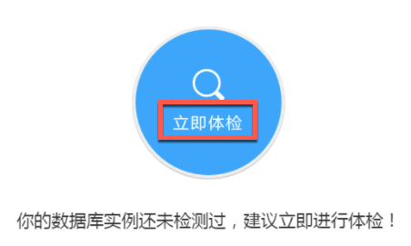
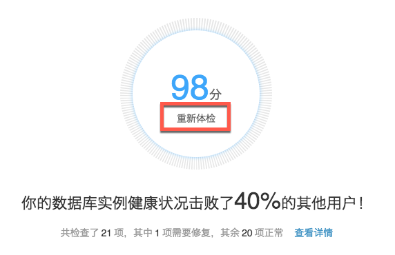
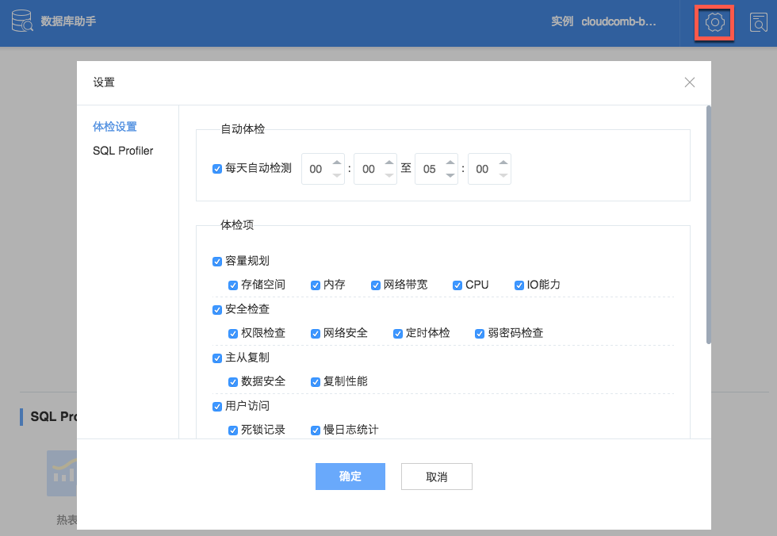

# 数据库助手

数据库助手是蜂巢 RDS 的增值服务，为 MySQL 数据库实例提供专业的数据库管理和运维工具。

## 功能特点

*  健康检查
	* 旨在帮助你提前预知数据库运行风险，给出必要的改进方案和建议，将风险消灭在摇篮中，提升数据库服务质量。通过执行数据库健康检查，可获得直观的健康指数，快速判断当前数据库是否存在风险及其严重程度，并获取对应的修复建议。参考该建议，你可做出必要改进，消除风险，从而提升数据库稳定性。
* SQL Profiler
	* 热表：统计 CRUD 操作记录
	* SQL 排行榜：三个维度（执行次数、执行时间、扫描记录数）统计 SQL 排行榜
	* 慢 SQL：统计慢查询记录
* 实用工具
	* 在线修改表结构：修改列、索引、外键、表，执行 SQL 
	* WebSQL：Web 版客户端，详见：[WebSQL 连接 RDS](../md.html#!平台服务/RDS/使用指南/连接实例/WebSQL连接RDS.md)
	* 表结构对比：对比各实例各数据库的表、函数、存储过程、触发器

## 数据库助手入口

**A：**目标实例 Dashboard，点击健康检查指数下方数值
**B：**目标实例右侧操作列 ➡ 更多 ➡ 健康检查

## 健康检查

* 首次进入数据库助手，系统将提示「你的数据库实例还未检测过，建议立即进行体检！」，点击「**立即体检**」，开始体检：

* 未来进入数据库助手，点击「**重新体检**」，开始体检：

### 检查项

| 检查类别 |         检查目的         |                   检查项                   |
|----------|--------------------------|--------------------------------------------|
| 容量规划 | 检测当前资源是否成为瓶颈 | CPU、IO能力、网络带宽、存储空间、内存      |
| 安全检查 | 检查服务是否存在安全隐患 | 弱密码检查、定时体检、网络安全、权限检查   |
| 主从复制 | 检查主从复制是否存在隐患 | 复制性能、数据安全                         |
| 用户访问 | 检查用户访问是否正常     | 死锁记录、慢日志统计                       |
| 参数检查 | 检查相关配置参数是否合理 | 内存参数、重做日志、二进制日志、连接数配置 |
| 索引检查 | 检测索引设计是否合理     | 主键检查、无效索引、冗余索引、索引区分度   |

### 检查结果

1. 体检完成后，系统给出数据库实例的最终得分、待修复项数量等；
2. 点击「**查看详情**」，可查看体检过程中各检查项的详细状态；
3. 点击「**待修复项**」，可以查看该问题的详情和修复建议；
点击右侧「**问题详情**」，可以查看所有待修复问题和修复建议：

Note:
修复对应问题后，建议重新体检以确保问题得以彻底解决。

### 体检设置

点击右上角设置按钮，可以设置自动体检（默认关闭）和体检项。
系统将在设定时间段内的业务空闲时间自动进行健康检查，你可随时登录系统查看检查结果。

Attention:
为保证数据库服务性能，建议选择业务较空闲的时间段进行健康检查。

