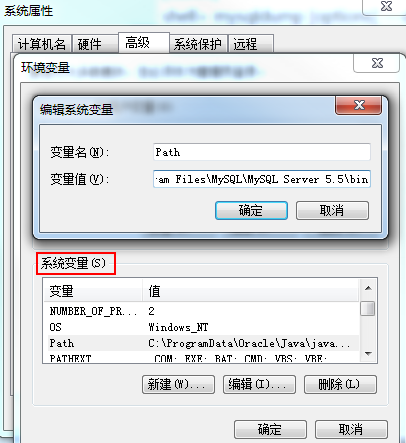

# 迁移与备份常见问题

#### Q：如何将外部实例数据导入到蜂巢 RDS 中？

A：详见 [数据迁移](../md.html#!平台服务/RDS/使用指南/迁移外部数据库.md)。

#### Q：在 Windows 环境，为什么 mysqldump 命令无法使用？

A：MySQL 安装完成后，mysqldump.exe 存在于安装目录下的 bin 文件夹中。此时需要 bin 文件夹的路径添加到系统变量的 Path 中，例如:C:\Program Files\MySQL\MySQL Server 5.5\bin，之后 mysqldump 命令即可使用。

#### Q：如何进行 RDS 备份恢复？

A：
数据库实例提供了非常简便的方法来进行数据备份和恢复，只需在实例的备份管理页面进行相应操作即可。RDS 提供全量备份和增量备份功能：

* 创建时默认为全量备份，用户可通过实例「设置」操作来修改备份类型。
* 增量备份的实例提供了 Point-In-Time（[MySQL官方开发文档：Point-In-Time 恢复](https://dev.mysql.com/doc/refman/5.6/en/point-in-time-recovery.html)） 的恢复功能，极大地提高了数据库的回滚精度。

具体请参见 [备份与恢复](../md.html#!平台服务/RDS/使用指南/备份与恢复/RDS自动备份.md) 以及 [PIT恢复](../md.html#!平台服务/RDS/使用指南/备份与恢复/RDS-PIT恢复.md) 。

