# 基本操作

Windows云主机管理入口位于蜂巢首页的Windows主机服务选项。点击「Windows主机」，即可显示你所有的Windows主机。你可以在该界面对Windows主机进行创建、删除、启动、重启以及停止等一系列操作，此外还可以对云主机相关数据进行设置，获取云主机VNC，以及进行从镜像恢复，挂/卸载云硬盘，挂/卸载外网端口等操作。

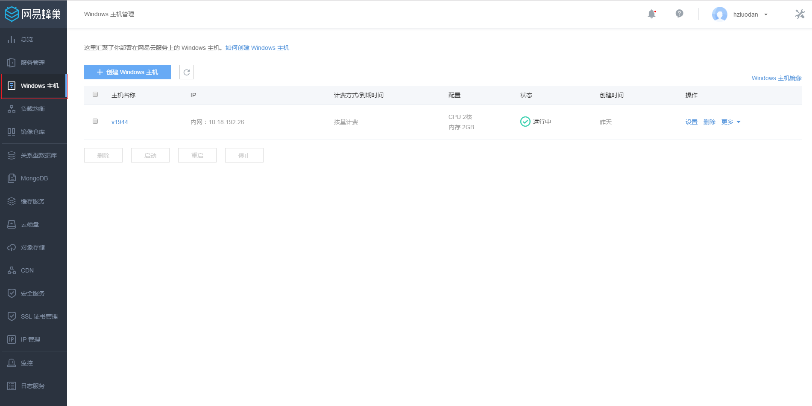

## 创建Windows云主机

在Windows云主机主界面，点击「创建Windows云主机」就可创建一台新的Windows云主机。创建云主机的界面如下图所示：首先选择使用的镜像，选择云主机CPU、内存、系统盘大小，然后填写云主机名称和描述，点击「立即创建」按钮，开始创建云主机。

Attention:
云主机创建默认不开启公网，不挂载云硬盘，创建完成后，可以再在云主机详情页面在线绑定公网端口和挂载云硬盘。

创建过程中，云主机的状态显示为：创建中。当创建完成后，云主机的状态会显示为：运行中，这时候就可以对云主机进行其他操作了。

点击「主机名称」，即可进入云主机「详细信息」界面，如下图所示：

## 登录Windows云主机

### 初次登录云主机
<a href="#firstlogin">¶</a>

如果是从网易蜂巢提供的基础镜像新创建的云主机，首次登录到该云主机，需要使用VNC控制台登录云主机进行系统初始化，设置管理员用户名和密码，之后才可以登录云主机内部。

以Windows Server 2012R2镜像创建的一台云主机为例：

点击云主机详情页面上的「VNC」。

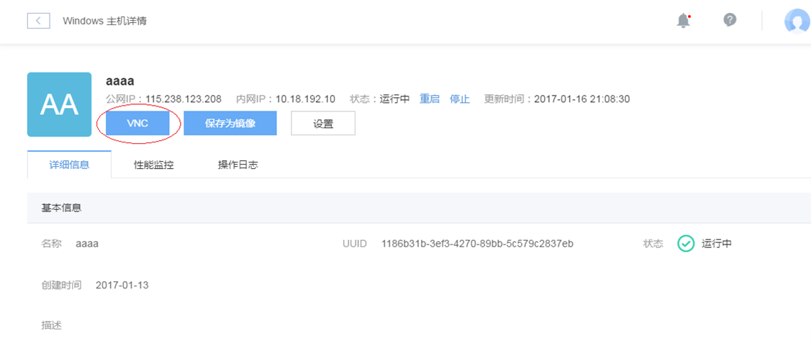

在弹出的页面上方输入VNC密码，按回车。

Attention:
VNC密码仅在第一次进行VNC登陆的时候显示，以后将不再显示，请牢记。

如果看到上述屏保页面，请点击页面右上方的【Send CtrlAltDel】

进入登录页面。开始为你的云主机设置管理员密码。密码需要满足一定的复杂度才可通过。

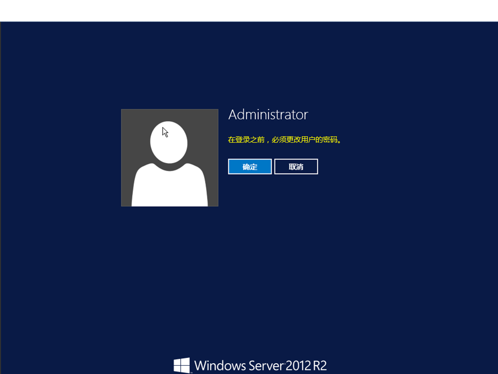

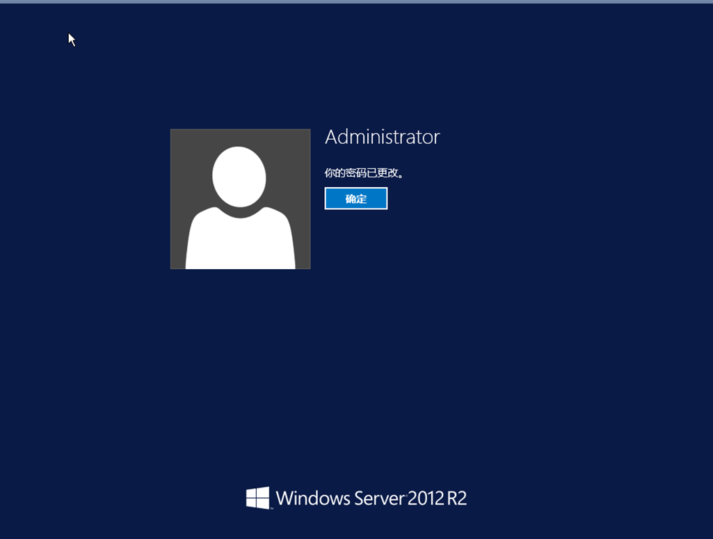

点击确定之后，即可登录进云主机内部：

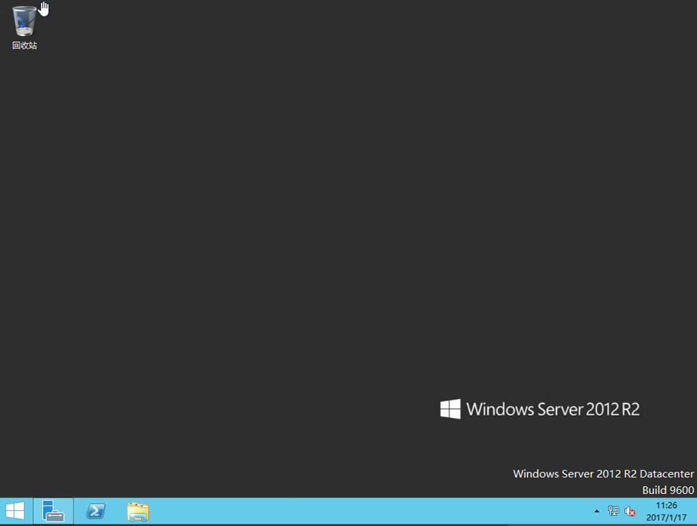

Attention:
我们提供的Windows操作系统云主机都是未激活的版本，你需要自行购买序列号并在初始化过程中进行设置和激活，否则可能导致你的云主机无法正常使用。

### 非初次登录

如果是非首次登录，除上述通过VNC控制台 + 密码登录的方法之外，还可以通过远程连接的方式登录云主机。

Attention:
为了方便您的使用，我们已经默认打开了远程桌面登录功能，如果您不需要该功能，建议进行关闭。

如果你有给云主机绑定过公网IP，可以直接使用远程连接到此公网IP访问云主机。

如果没有给云主机绑定过公网IP，可以使用VPN连接 + 云主机私有网IP的方式访问云主机。

关于如何使用VPN，可以参考 [如何使用蜂巢OpenVPN](https://c.163.com/wiki/index.php?title=%E5%A6%82%E4%BD%95%E4%BD%BF%E7%94%A8%E8%9C%82%E5%B7%A2OpenVPN)

连接上了蜂巢VPN之后，打开windows远程桌面连接，输入云主机IP地址（可以在云主机详情页面上查看）

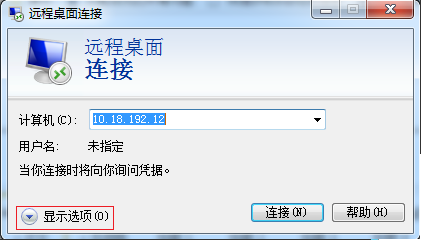

点击[显示选项]，输入用户名

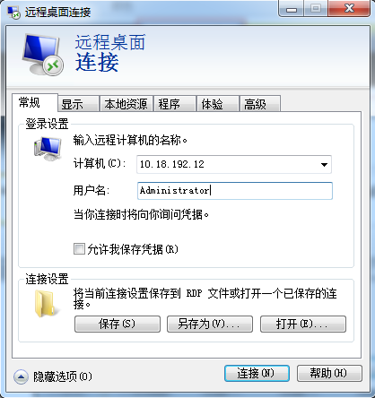

输入账户密码，点击【连接】，

在弹出的页面中选择【是】，即可通过远程连接登录到云主机，

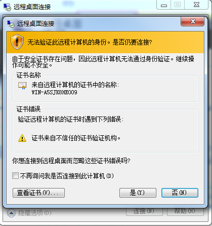

## 保存为镜像

你可以将当前云主机保存为自定义镜像，在云主机详情界面上点击“保存为镜像”，填写相关信息，即可将当前云主机保存为自定义镜像。

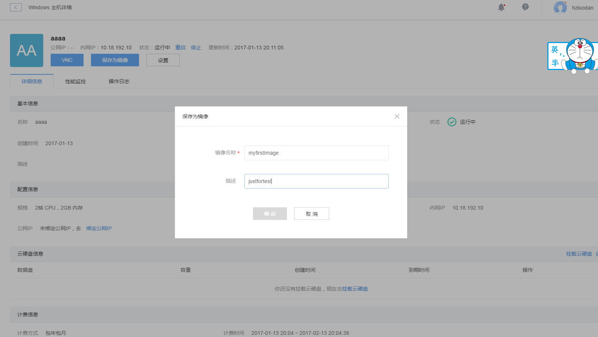

保存了自定义镜像之后，可以在云主机详情页面右上角，点击【Windows主机镜像】，查看自定义Windows主机镜像信息，并进行相关管理操作。

今后可以使用这些镜像来创建和恢复云主机。

Attention:
建议先关闭云主机之后再进行自定义镜像的创建，以保证所有缓存数据都写入磁盘。

## 设置云主机

点击云主机详情页面上的【设置】，设置页面提供了对云主机相关信息的修改功能。

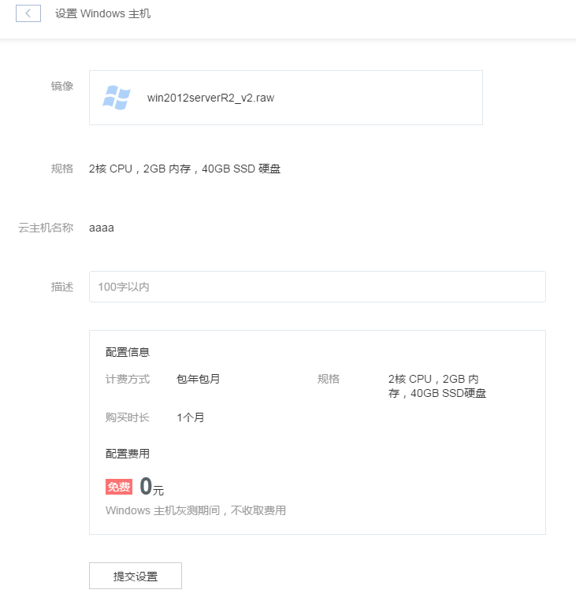

## 从镜像恢复

点击云主机详情页面上的 【从镜像恢复】，即可使用将当前云主机系统盘从镜像恢复的功能。

你选择了目标镜像之后，将会立刻开始从该镜像恢复云主机。

该操作会将云主机原系统盘数据清空，按照所选镜像进行恢复，请谨慎使用该操作。

** 注意: **

** 从镜像恢复云主机，云主机的vnc密码不变，原云主机公网端口仍然会绑定在该云主机上。**

** 云硬盘中的数据仍然会保留，并且挂载在该云主机上，但是可能需要进入云主机中重新进行云硬盘初始化联机操作（比如云硬盘未分配盘符的情况），操作方法请参考[初始化云硬盘](http://support.c.163.com/md.html#!平台服务/Windows云主机/使用指南/挂载云硬盘.md#formatvolume) 。**

** 如果您是从网易蜂巢提供的基础镜像恢复的云主机，则Windows系统的管理员登录密码会改变，需要重新设置，请参考<a href="#firstlogin">初次登录云主机</a>

[初次登录云主机](http://support.c.163.com/md.html#!平台服务/Windows云主机/使用指南/windows云主机基本操作.md#firstlogin)。创建云主机的界面如下图所示：首先选择使用的镜像，选择云主机CPU、内存、系统盘大小，然后填写云主机名称和描述，点击「立即创建」按钮，开始创建云主机。**

** 如果是从您的自定义镜像恢复的云主机，则登录密码与自定义镜像保持一致。**

## 性能监控

点击「性能监控」板块，可以查看当前云主机的状态监控数据，包含有CPU利用率、内存利用率、网络流入流出量、磁盘读写操作延时、磁盘吞吐量、磁盘IOPS六个监控项。

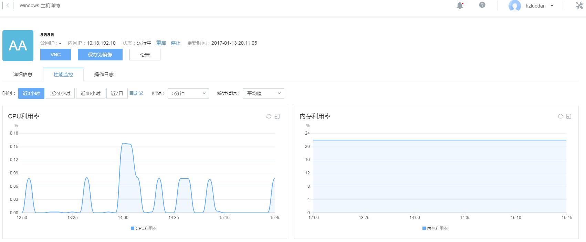

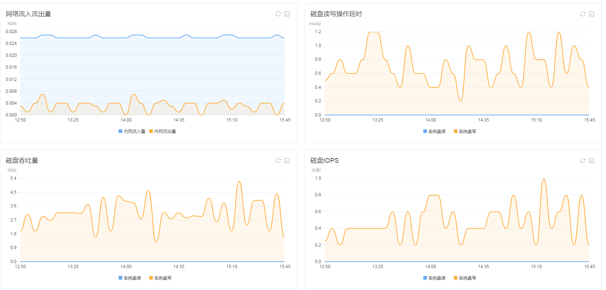

## 操作日志

点击「操作日志」板块，可以查看最近对云主机的操作

## 自定义镜像列表

在云主机列表右上方点击【Windows 主机镜像】

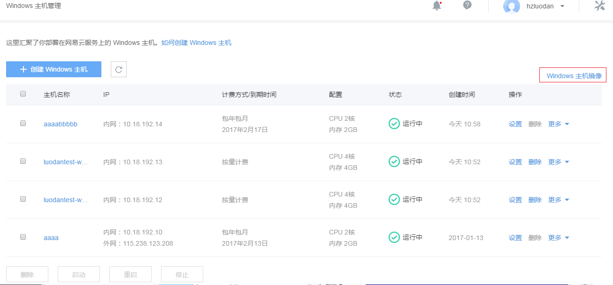

可以在该页面上查看所有的自定义windows主机镜像，并进行管理操作。

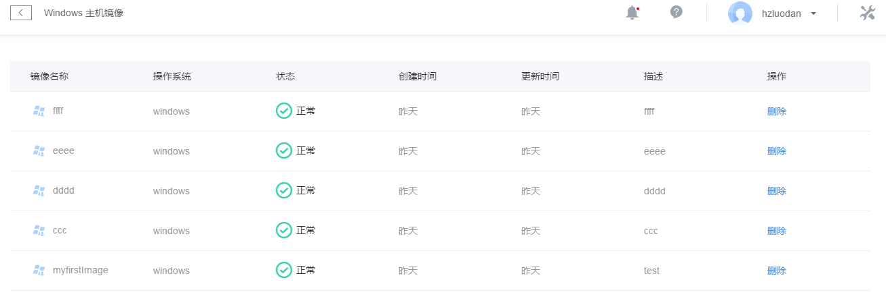

