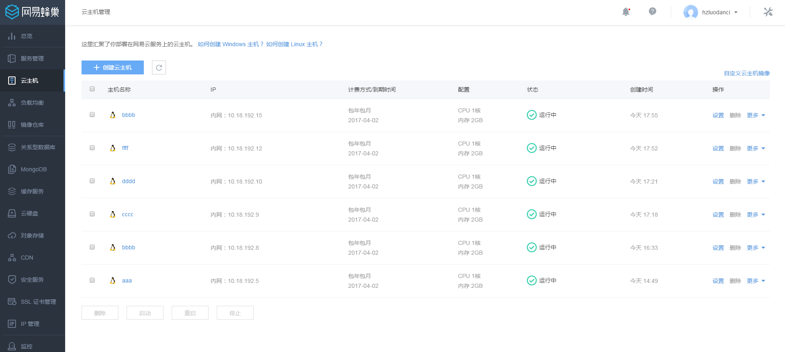
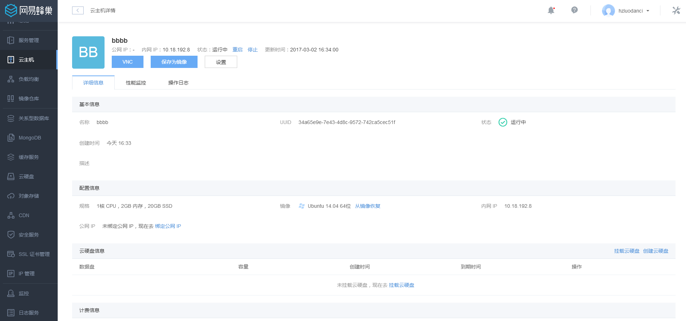
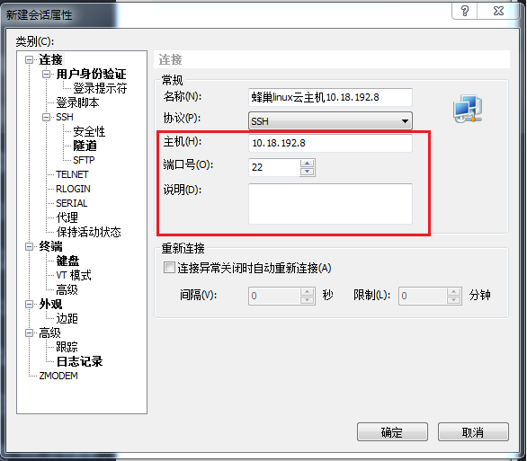
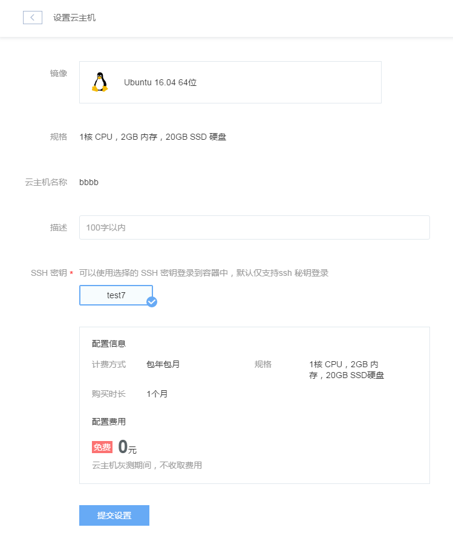
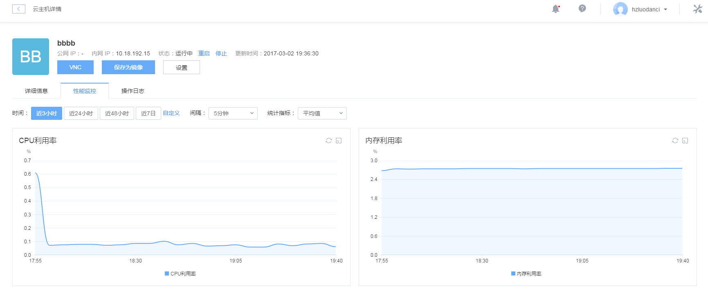

# 基本操作

linux云主机管理入口位于蜂巢首页的云主机服务选项。点击「云主机」，即可显示你所有的云主机。你可以在该界面对云主机进行创建、删除、启动、重启以及停止等一系列操作，此外还可以对云主机相关数据进行设置，获取云主机VNC，以及进行从镜像恢复，挂/卸载云硬盘，挂/卸载外网端口等操作。

## 创建linux云主机

在云主机主界面，点击「创建云主机」就可创建一台新的linux云主机。创建linux云主机的界面如下图所示：首先选择使用的linux镜像，选择云主机CPU、内存、系统盘大小，然后填写云主机名称和描述，
对于linux云主机，还必须选择注入的SSH密钥，用于后续登录linux云主机。你可以直接选择当前蜂巢平台已有密钥，也可以重新创建SSH密钥。最多支持创建时对linux云主机注入5个密钥。

点击「立即创建」按钮，开始创建云主机。

Attention:
云主机创建默认不开启公网，不挂载云硬盘，创建完成后，可以再在云主机详情页面在线绑定公网端口和挂载云硬盘。

创建过程中，云主机的状态显示为：创建中。当创建完成后，云主机的状态会显示为：运行中，这时候就可以对云主机进行其他操作了。

点击「主机名称」，即可进入云主机「详细信息」界面，如下图所示:

## 登录linux云主机

### 初次登录云主机

目前提供两种访问linux云主机的方式，第一种是通过SSH进行登录，第二种是通过VNC控制台进行登录。

####1.SSH方式

SSH方式就是通过SSH客户端工具，连接到云主机的IP地址和相应的端口进行登录，IP通常需要使用外网IP，如果没有绑定外网端口，可以使用蜂巢VPN来通过云主机的私有网IP登录，认证方式一般为密钥方式。

关于如何使用蜂巢VPN，请参考http://support.c.163.com/md.html#!容器服务/服务管理/使用技巧/如何使用蜂巢 OpenVPN.md

关于如何使用SSH密钥登录，请参考http://support.c.163.com/md.html#!容器服务/服务管理/使用技巧/如何使用 SSH 密钥登录.md

Attention:
云主机默认登录用户名为root。

####2.VNC控制台方式

VNC控制台方式就是直接在产品管理员界面上选择云主机之后点击“更多”中的“VNC”按钮，需要输入云主机的用户名密码进行登录，请注意云主机默认屏蔽了用户名密码的登录方式，如果你需要使用VNC登录，请在ssh登录后，手工修改密码后再使用VNC控制台登录，另外需要注意VNC页面上的提示信息。VNC密码将在第一次VNC控制台方式登录的时候提示，下次登录将不再提示。

ssh方式需要网络支持才可以使用，VNC不需要网络支持也可以使用，你可以认为VNC就是云主机的显示器。

以 Ubuntu 14.04 64位 镜像创建的一台云主机为例：

连接上用户VPN之后，在云主机页面上可以看到该云主机的内网IP，如果绑定了外网IP可以使用外网IP

这里以Xshell5为例，

1、安装并运行 Xshell，点击「文件」-「新建」，在「连接」目录输入相关信息：

2、在「连接」-「用户身份验证」目录输入相关信息，用户名输入「root」：

3、点击「浏览」按钮，弹出「用户密钥」窗口。点击「导入」，选择并导入本地公钥，后续点击「确定」即可完成连接。

## 保存为镜像

你可以将当前云主机保存为自定义镜像，在云主机详情界面上点击“保存为镜像”，填写相关信息，即可将当前云主机保存为自定义镜像。

保存了自定义镜像之后，可以在云主机列表页面右上角，点击【自定义云主机镜像】，查看自定义云主机镜像信息，并进行相关管理操作。

今后可以使用这些镜像来创建和恢复云主机。

Attention:
建议先关闭云主机之后再进行自定义镜像的创建，以保证所有缓存数据都写入磁盘。

## 设置云主机

点击云主机详情页面上的【设置】，设置页面提供了对云主机相关信息的修改功能。

## 从镜像恢复

点击云主机详情页面上的 【从镜像恢复】，即可使用将当前云主机系统盘从镜像恢复的功能。

Attention:
原本为Windows操作系统的云主机，不能选择Linux镜像进行恢复。原本为Linux操作系统的云主机，不能选择Windows镜像进行恢复。

选择了目标镜像之后，将会立刻开始从该镜像恢复云主机。

该操作会将云主机原系统盘数据清空，按照所选镜像进行恢复，请谨慎使用该操作。

注意: 

从镜像恢复云主机，云主机的vnc密码不变，原云主机公网端口仍然会绑定在该云主机上。

云硬盘中的数据仍然会保留，并且挂载在该云主机上。但是需要重新执行mount挂载操作，具体请参考【Linux云主机】->【挂载云硬盘】。

如果您是从网易蜂巢提供的基础镜像恢复的云主机，则Linux系统的root密码会改变，需要重新设置，可以通过SSH方式登录到云主机内部进行修改。

如果是从您的自定义镜像恢复的云主机，则root密码与自定义镜像保持一致。

## 性能监控

点击「性能监控」板块，可以查看当前云主机的状态监控数据，包含有CPU利用率、内存利用率、网络流入流出量、磁盘读写操作延时、磁盘吞吐量、磁盘IOPS六个监控项。

## 操作日志

点击「操作日志」板块，可以查看最近对云主机的操作

## 自定义镜像列表

在云主机列表右上方点击【自定义云主机镜像】

可以在该页面上查看所有的自定义云主机镜像，并进行管理操作。

