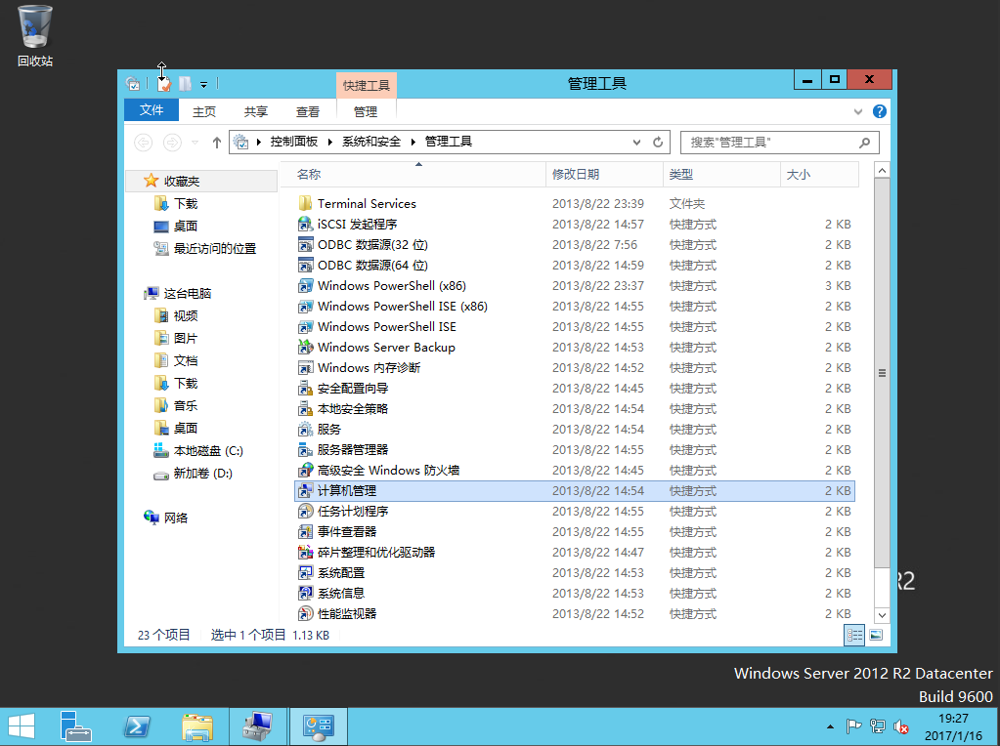
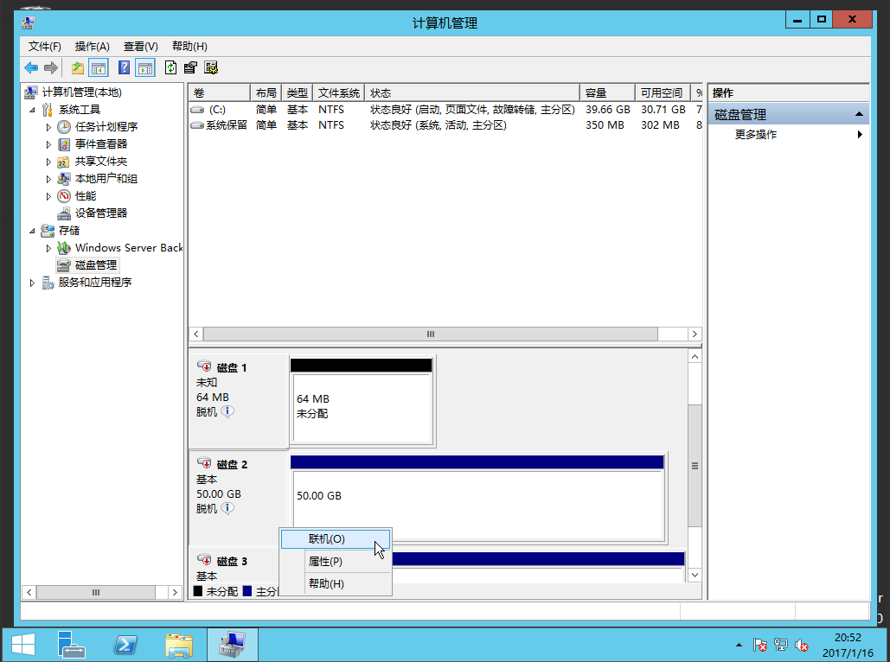
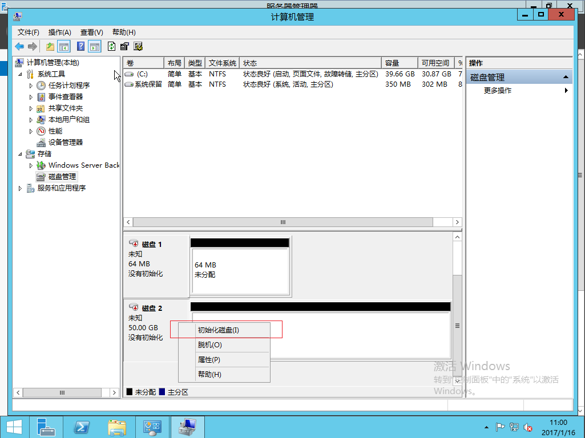
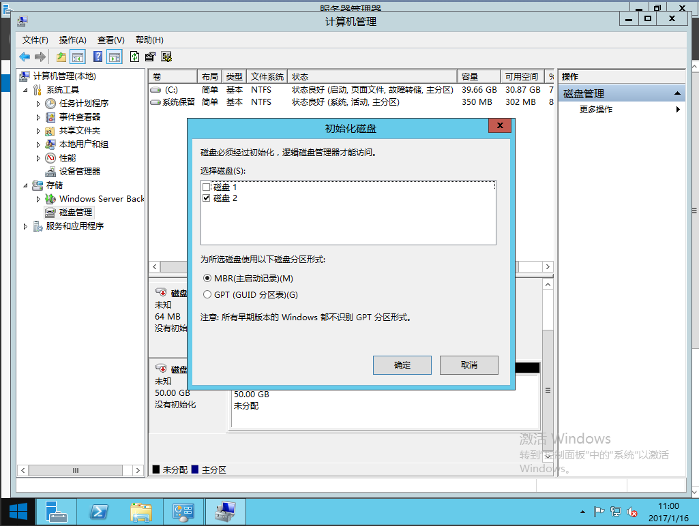
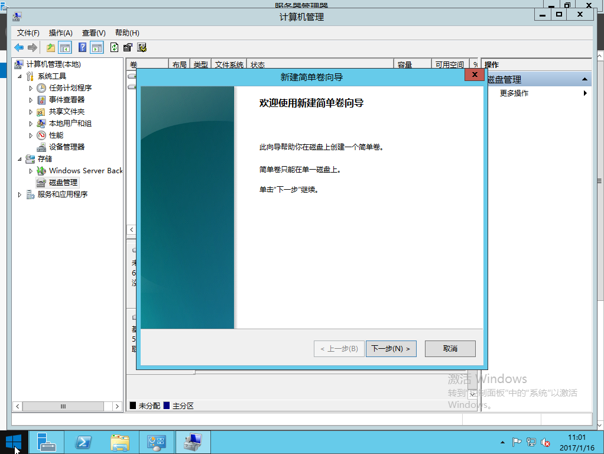
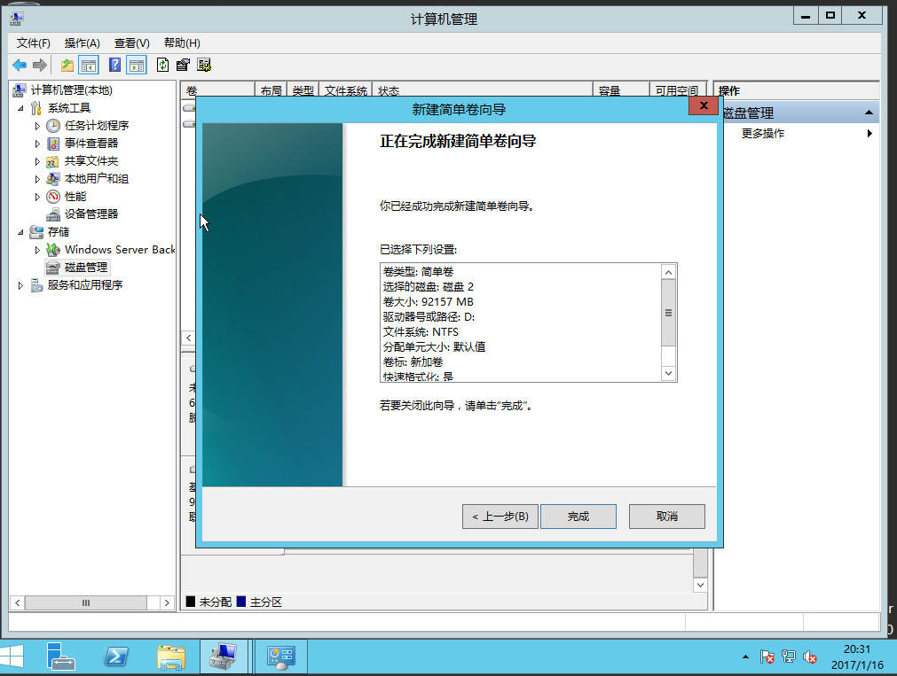
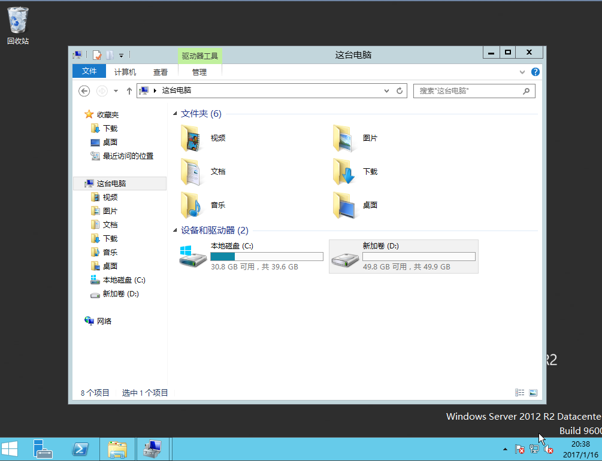

# 挂载云硬盘

在云主机详情页面，点击「挂载云硬盘」，可以为云主机挂载云硬盘。

如果你还没有云硬盘，就需要先创建一个。点击云主机详情页面上的「创建云硬盘」，或者页面左边的「云硬盘」标签，进入云硬盘管理页面，点击「创建云硬盘」，就可以开始创建操作。

填写好名称以及相关信息，适用范围需要选择 「Windows云主机」，然后点击「立即创建」。

成功创建完成后，可以在云硬盘列表里看到它。

如果你已经拥有了可用的云硬盘，可以在云主机详情页面直接点击「挂载云硬盘」，

在下拉列表里选择要挂载的云硬盘，点击「确定」即可将该云硬盘挂载到云主机。

如果绑定成功，在云硬盘管理页面中，可以看到该云硬盘的「挂载状态」变成「已挂载」

对于新创建出来，初次被挂载的云硬盘，执行上面的挂载操作之后，该盘并不是立即可用的，你需要登陆进Windows云主机对它进行初始化操作。

关于如何登陆云主机请参考：[基本操作](http://support.c.163.com/md.html#!平台服务/Windows云主机/使用指南/windows云主机基本操作.md)里的「登录Windows云主机」。

## 初始化云硬盘

Attention:
该操作仅针对新创建的云硬盘，已经被初始化且完成过格式化过的云硬盘，则不需要再初始化，挂载到云主机后，联机即可使用。

首先登录进云主机。关于如何登陆云主机请参考：[基本操作](http://support.c.163.com/md.html#!平台服务/Windows云主机/使用指南/windows云主机基本操作.md)里的「登录Windows云主机」。

以Windows Server 2012R2镜像创建的一台云主机为例：

点击页面左下角的「开始」按钮，选择「管理工具」。

再选择「计算机管理」

打开计算机管理面板，点击左侧的「磁盘管理」，在下方找到刚才在页面上挂载的云硬盘，右键点击磁盘名，在弹出菜单中选择「联机」，如果磁盘已经处于联机状态，可以直接转到下一步「初始化磁盘」。 

联机完成后，再右键点击磁盘名，选择「初始化磁盘」

然后选择挂载的 磁盘2，点击「确定」（图中的磁盘1是config drive盘，初始化操作时请不要点选）

初始化磁盘完成后，右键点击磁盘名右边的区域，选择「新建简单卷」 

** 注意：除简单卷之外,其它卷类型都未经测试，不建议使用，使用过程中出现问题, 技术人员无法提供技术支持。**

一直点选「下一步」，在此过程中，系统会为该盘自动分配盘符。

最后点击「完成」，开始格式化操作，该操作需要一段时间完成，建议在一个盘格式化完成之后，再初始化操作下一个挂载的云硬盘，否则可能会导致云硬盘默认盘符冲突。

格式化完成后，即可在「这台电脑」中看到该硬盘。

