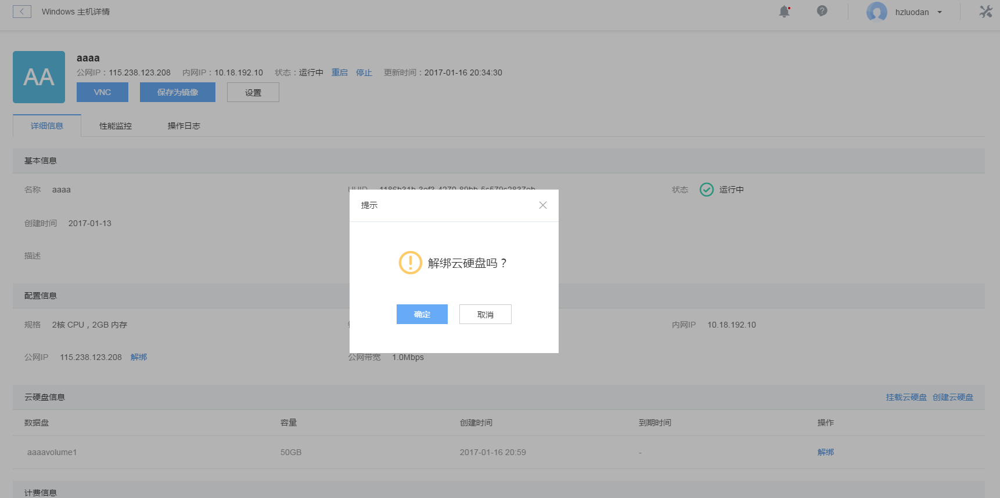

# 解绑云硬盘

Attention:
在卸载云硬盘之前，需要确保在云主机中该块云硬盘已经没有在使用了，包括停止对该云硬盘的磁盘读写操作。
如果该云硬盘已经创建文件系统并联机分配盘符，建议先将该盘脱机，如无法脱机，请结束相关磁盘读写进程或者关机后再进行卸载。

否则，直接从界面上卸载，会导致云主机操作系统异常，可能会发生蓝屏以及其他问题。

在云主机详情页面，对需要卸载的云硬盘，点击页面右边的【解绑】。

之后会弹出一个对话框，提示是否确认卸载，请确认此时已经在云主机中卸载掉该云硬盘。

如果确定，就点击“确定“按钮开始解绑云硬盘。

云硬盘解绑之后，如果需要再使用，还可以进行挂载操作，之前的数据仍然可用。

如果解绑成功，在云硬盘管理页面中，可以看到该云硬盘的“挂载状态”变成“可用”。

如果长时间处于“挂载中”的挂载状态，有可能是挂载过程中出错，需要联系工单系统进行处理。

注意：删除云主机，会自动将挂载到该云主机的云硬盘卸载掉，但并不会删除。
更多关于云硬盘的相关操作请参考：[云硬盘相关操作](http://support.c.163.com/md.html#!平台服务/云硬盘/使用指南/创建云硬盘.md)

