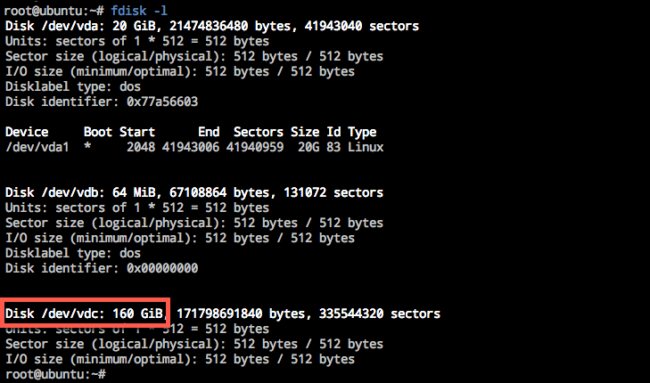
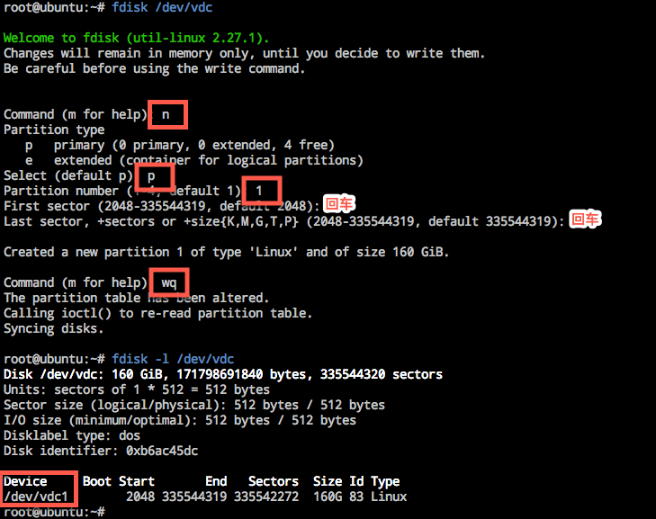

# Linux 云主机分区、格式化、挂载数据盘

在控制台挂载云硬盘后，系统需要先格式化，再挂载数据盘
您还可以根据业务需要，对数据盘进行多分区配置。建议使用系统自带的工具进行分区操作。

格式化后，数据盘中的数据将被全部清空。请在格式化之前，确保数据盘中没有数据或对重要数据已进行备份。

该操作仅针对新创建的云硬盘，已经被初始化且完成过格式化过的云硬盘，则不需要再格式化，在页面上挂载到云主机后，进入云主机里执行mount命令即可使用。

## 操作步骤

适用于所有官方 Linux 镜像（CentOS/Ubuntu/Debian）创建的云主机。

### 1. 连接实例

使用 SSH 或 VNC 方式登录云主机，详请参见：[如何登录 Linux 云主机](http://support.c.163.com/md.html#!容器服务/云主机/使用指南/linux主机登录方法.md) 。

### 2. 确认已挂载的数据盘

使用如下命令查看已挂载的数据盘：

	fdisk -l

下方示例中可以看到刚挂载的数据盘 `/dev/vdc` 大小为是 10 GB。以下内容都将以块设备 `/dev/vdc` 作为示例。

### 3. 分区

使用如下命令对数据盘分区：

	fdisk {disk} #本示例中为 fdisk /dev/vdc 

根据提示，依次输入 n（新建分区）、p（新建扩展分区）、1（使用第 1 个主分区），两次回车（使用默认配置），输入 wq（保存分区表），再回车开始分区。

### 4. 格式化

使用如下命令对新分区格式化：

	mkfs.{fstype} {device} #本示例中为 mkfs.ext3 /dev/vdc1

格式化时间取决于数据盘大小，也可以按需选择其他如 ext4 等文件格式。

### 5. 挂载

使用如下命令将新分区挂载至云主机文件夹：

	mount {device} {dir} #本示例中为 mount /dev/vdc1 /mnt

使用 `df -h` 命令确认挂载成功。

