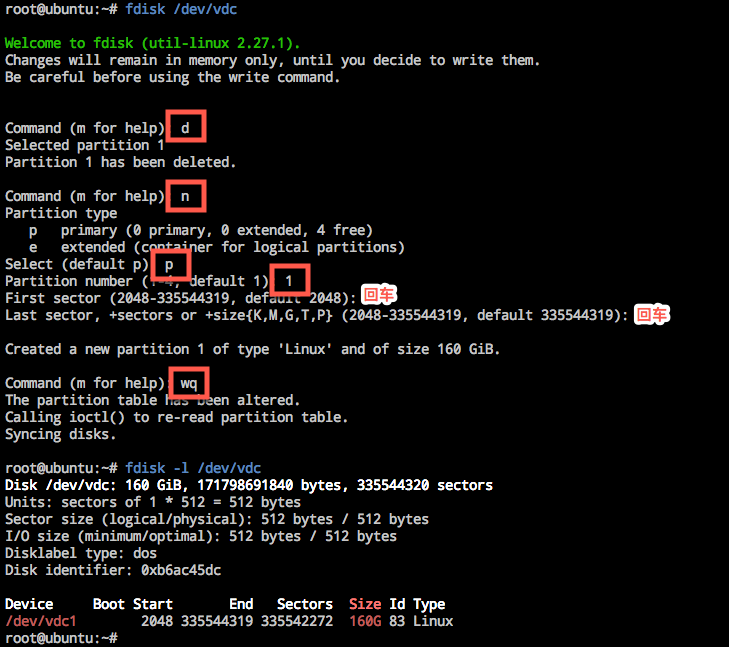
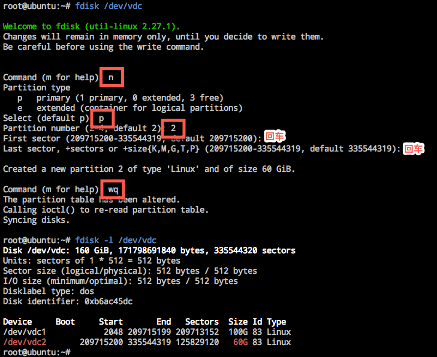
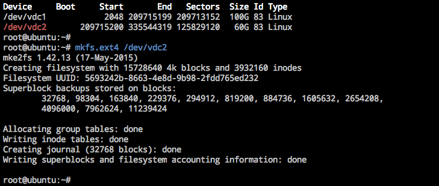
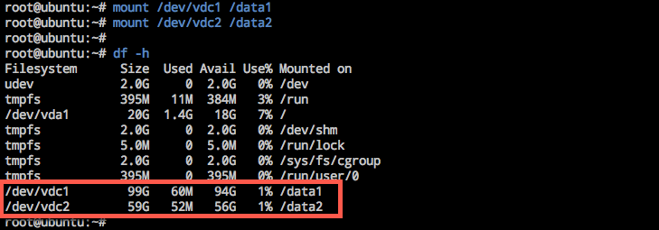

# 扩容 Linux 云主机文件系统（MBR 分区表）

Note:
1. 面向云主机的云硬盘，扩容后需要扩容文件系统，以便云主机可以使用扩容的空间； 2. 面向服务的云硬盘，扩容后将自动生效，无需手动扩容文件系统； 3. 操作前请确保已经扩容了云硬盘，详见 [扩容云硬盘](http://support.c.163.com/md.html#!平台服务/云硬盘/使用指南/扩容云硬盘.md)； 4. 以下指引在正常操作的情况下不会丢失数据； 5. 适用于所有蜂巢官方 Linux 镜像（CentOS/Ubuntu/Debian）创建的云主机。

## 确认分区形式

不同的分区表操作不同，请 [确认分区表](http://support.c.163.com/md.html#!平台服务/云硬盘/运维指南/Linux云主机/Linux云主机查看数据盘分区信息.md) 后，再选择对应指引进行后续操作：

* [GPT 分区操作指引](http://support.c.163.com/md.html#!平台服务/云硬盘/使用指南/扩容文件系统/扩容Linux云主机文件系统-GPT.md)
* [MBR 分区操作指引](http://support.c.163.com/md.html#!平台服务/云硬盘/使用指南/扩容文件系统/扩容Linux云主机文件系统-MBR.md)

## MBR 分区操作指引

按需选择扩容原分区或新建分区。

### 1. 扩容原分区

#### 1.1. 连接云主机

使用 SSH 或 VNC 方式登录云主机，详请参见：[如何登录 Linux 云主机](http://support.c.163.com/md.html#!容器服务/云主机/使用指南/linux主机登录方法.md) 。

#### 1.2. 查看数据盘信息

使用如下命令查看已挂载的数据盘信息：

	fdisk -l
	df -h

下方示例中可以看到挂载数据盘 `/dev/vdc` 的信息：
* 容量：160 GB（扩容前 100 GB）
* 分区：`/dev/vdc1`（100 GB）
* 挂载点：`/data1`

以下内容都将以该数据盘 `/dev/vdc` 作为示例。

#### 1.3. 卸载目标分区

使用如下命令卸载已挂载的目标分区：

	umount {dir} #示例中为 umount /data1

#### 1.4. 删除原分区再新建分区

使用如下命令删除原分区：

	fdisk {disk} #本示例中为 fdisk /dev/vdc

根据提示，依次输入 **d**（删除分区）➡ **n**（新建分区）➡ **p**（新建扩展分区）➡ **2**（使用第 2 个主分区） ➡ 两次回车（使用默认配置）➡ 输入 **wq**（保存分区表）➡ 再回车开始分区。

#### 1.5. 检查文件系统

使用如下命令检查扩容后分区的文件系统：

	e2fsck -f {device} #本示例中为 e2fsck -f /dev/vdc1

#### 1.6. 扩容文件系统

使用如下命令扩容文件系统：

	resize2fs {device} #本示例中为 resize2fs /dev/vdc1

#### 1.7. 挂载新分区

Note:
手动挂载数据盘的云主机重启后，挂载将失效；若需开机自动 mount 数据盘，则必须将分区信息写入 /etc/fastab 中，详见 [如何自动挂载数据盘](http://support.c.163.com/md.html#!平台服务/云硬盘/运维指南/Linux云主机/Linux云主机自动挂载数据盘.md) 。

使用如下命令将新分区挂载至云主机文件夹：

	mount {device} {dir} #本示例中为 mount /dev/vdc1 /data1

使用 `df -h` 命令确认挂载成功：

### 2. 新建分区

#### 2.1. 连接云主机

使用 SSH 或 VNC 方式登录云主机，详请参见：[如何登录 Linux 云主机](http://support.c.163.com/md.html#!容器服务/云主机/使用指南/linux主机登录方法.md) 。

#### 2.2. 查看数据盘信息

使用如下命令查看已挂载的数据盘信息：

	fdisk -l
	df -h

下方示例中可以看到挂载数据盘 `/dev/vdc` 的信息：
* 容量：160 GB（扩容前 100 GB）
* 分区：`/dev/vdc1`（100 GB）
* 挂载点：`/data1`

以下内容都将以该数据盘 `/dev/vdc` 作为示例。

#### 2.3. 卸载目标分区

使用如下命令卸载已挂载的目标分区：

	umount {dir} #示例中为 umount /data1

#### 2.4. 数据盘分区

使用如下命令对数据盘扩容部分新建分区：

	fdisk {disk} #本示例中为 fdisk /dev/vdc 

根据提示，依次输入 **n**（新建分区）➡ **p**（新建扩展分区）➡ **2**（使用第 2 个主分区） ➡ 两次回车（使用默认配置）➡ 输入 **wq**（保存分区表）➡ 再回车开始分区。

#### 2.5. 格式化并创建文件系统

使用如下命令对新分区格式化并创建文件系统：

	mkfs.{fstype} {device} #本示例中为 mkfs.ext4 /dev/vdc2

格式化时间取决于数据盘大小，也可以按需选择其他如 ext3 等文件格式（[如何查看分区的文件系统](http://support.c.163.com/md.html#!平台服务/云硬盘/运维指南/Linux云主机/Linux云主机查看分区文件系统.md) ）。

#### 2.6. 挂载新分区

Note:
手动挂载数据盘的云主机重启后，挂载将失效；若需开机自动 mount 数据盘，则必须将分区信息写入 /etc/fastab 中，详见 [如何自动挂载数据盘](http://support.c.163.com/md.html#!平台服务/云硬盘/运维指南/Linux云主机/Linux云主机自动挂载数据盘.md) 。

使用如下命令将所有分区挂载至云主机文件夹：

	mount {device} {dir} #本示例中为 mount /dev/vdc1 /data1 和 mount /dev/vdc2 /data2

使用 `df -h` 命令确认挂载成功：

