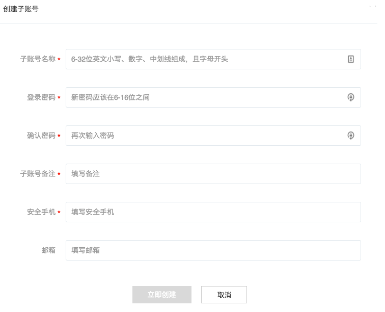
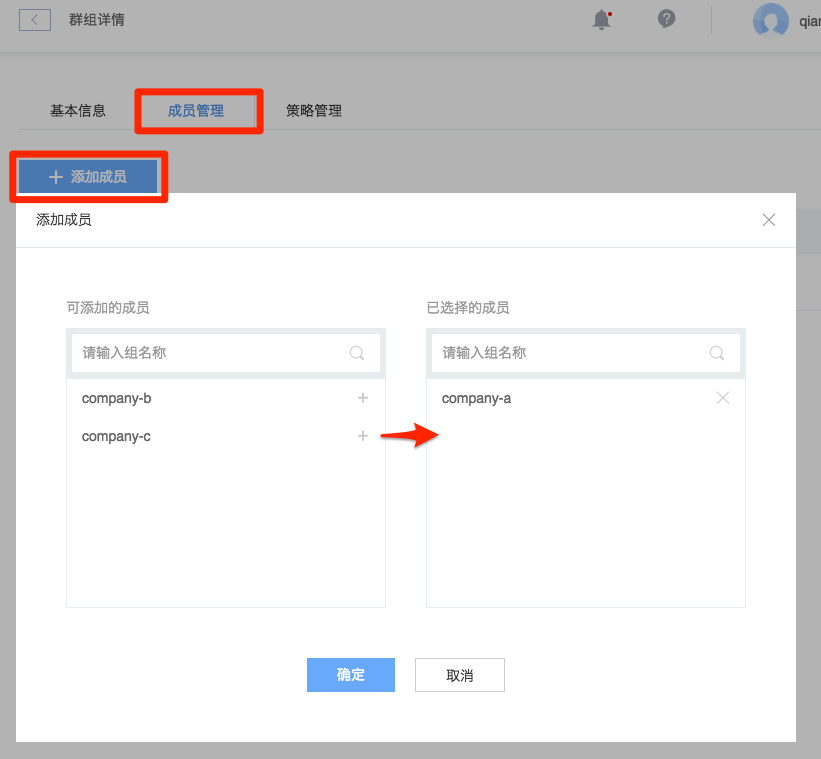
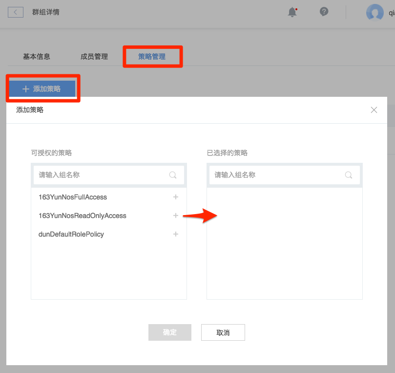
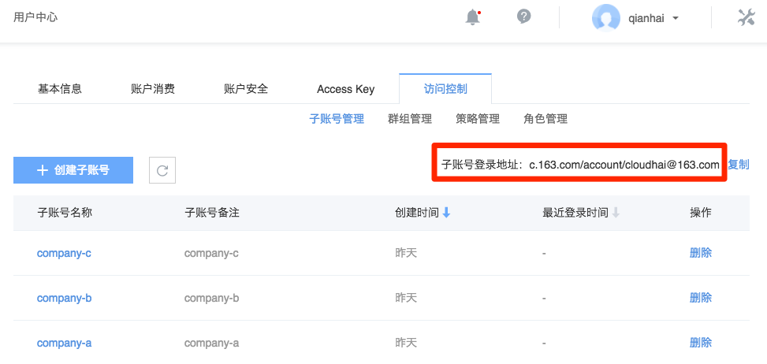

# 快速入门

访问控制提供子账户、角色等多种功能，最大限度地帮助用户做好权限分配和管理，同时处理好授权方面的一些难题。

Note:
出于安全考虑，需要在账户安全中绑定安全手机并开启安全验证，才可以开启访问控制。
默认子账号配额 50，群组 20，角色 30。若需要更多配额，请 [提交工单](http://yq-ci.163.com/dashboard#/m/ticket/create/?type=%E5%AE%89%E5%85%A8%E6%9C%8D%E5%8A%A1) 申请。

## 创建子账号

将鼠标移动到控制台右上角用户头像处，在弹出的下拉菜单中选择「访问控制」，然后点击「创建子账号」。

Note:
出于安全考虑，每次创建子账号均需要进行安全手机验证。

## 创建群组

群组与用户是多对多的关系。

## 群组添加子账号

1. 在「群组管理」内，点击需要添加权限的群组名称；
2. 在弹出的「群组详情」页面，点击「成员管理」标签；
3. 在弹出的「添加成员」页面，添加对应子账号。

## 授权群组

策略不直接授权给子账号，而是通过授权群组，子账号再加入群组的方式实现。策略与群组是多对多的关系，目前不支持自定义策略。

1. 在「群组管理」内，点击需要添加权限的群组名称；
2. 在弹出的「群组详情」页面，点击「策略管理」标签；
3. 在弹出的「添加策略」页面，将对应的策略授权。

## 子账号登录控制台

Attention:
子账号与主账号拥有不通的登录入口

在「用户中心」-「访问控制」-「子账号管理」处可以看到子账号登录地址，命名规则：`c.163.com/account/{主账号}`

登录前，需要设置初始密码，在「用户中心」-「访问控制」-「子账号管理」内点击对应的子账号名称，然后在弹出的「子账号详情」页重置登录密码。