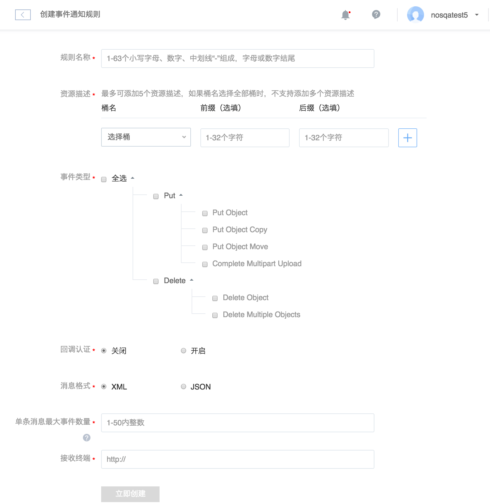

# 事件通知

## 介绍
NOS 对象存储推出重磅功能，支持特定事件的通知（回调）。用户可以通过在 NOS 上创建事件通知的规则，来关注对象存储资源上产生的事件，并且以消息的方式主动推送到指定的接收端。

## 注意事项
* 事件通知规则创建完，约 2 分钟后生效
* 配置重叠的事件规则时，会匹配所有规则，匹配到一条规则产生一条消息
* 事件通知规则只能创建和删除，目前不支持更新

## 作用
* 如果您对您的资源进行某些操作，而您又希望在其它模块关注这些操作的话，您就可以创建对应的规则，使得这些操作发生时，能够主动通知到其它模块。
* 如果您需要对操作进行统计的话，也可以通过事件通知的方式进行数据分析，查看一段时间内某个操作发生的次数，据此来分析您的业务最近有什么样的发展趋势。
* 您也可以通过事件通知监控您的资源上发生的某些操作的 QPS 等等指标。

## NOS 事件通知
NOS 支持将相关操作产生的事件通知到指定的接收端。其中：

* 失败的操作目前不会触发事件通知
* NOS 不对事件进行保存，重试发送不成功的会丢弃
* 产生事件后，如果接收端没启动，事件也会丢弃

### NOS 事件类型
NOS 支持的事件类型包括：

|         事件类型        |        说明       |
|-------------------------|-------------------|
| Put Object              | 上传数据到 NOS     |
| Put Object Copy         | NOS 资源拷贝       |
| Put Object Move         | NOS 桶内资源重命名 |
| Complete MultiPart      | 完成分块上传      |
| Delete Object           | 删除对象          |
| Delete Multiple Objects | 批量删除对象      |

Attention:
请求失败时，目前不会触发事件通知

### 举例说明如何使用 NOS 事件通知
某个用户开通了 NOS 服务，从桶概览页面可以进入事件通知管理，于是他就可以创建下面这样的事件通知规则：

* 规则名称：event-test-rule
* 资源描述：event-test/
* 事件类型：PutObject
* 回调认证：关闭
* 单条消息最大数量：30
* 接收终端：event-endpoint

在控制台可以很容易的管理事件通知，具体操作有：

#### 1、进入事件通知管理

如上图所示，点击事件通知管理，进入下图所示页面：

#### 2、创建规则

点击上述「创建时间通知规则」按钮，进入下图所示页面：

此处要填写具体信息有：

* 规则名称：1-63 个小写字母、数字、中划线组成，字母或数字结尾
* 资源描述：如果选择了一个桶，则匹配该桶中前后缀能够匹配的资源
* 事件类型：可以多选
* 回调认证：默认关闭，开启后，每次发往接收终端的 POST 请求会带认证头部信息
* 消息格式：推送的消息格式，支持 xml 和 json
* 单条消息最大事件数量：只是用来限制每次发往接收终端的最大消息数目，当消息没达到最大消息数量时，不会阻塞
* 接收终端：支持 HTTP 请求的服务器，目前只支持配置一个终端

点击「立即创建」就会创建好规则，并返回事件通知管理界面。

#### 3、删除规则

点击上面的删除按钮，该规则删除。

### NOS 事件通知发送接口

在用户配置规则中会携带接收终端，NOS 事件通知会将对应事件发往接收终端。如果用户配置的终端为：http://nos.eastchina1.126.net

#### 语法

	POST http://nos.eastchinal.126.net/message HTTP/1.1
	Date: ${date}
	Content-Md5:${md5}
	Content-Type: ${type}
	Authorization: ${signature}

|      参数     |                    说明                   |            是否必须            |
|---------------|-------------------------------------------|--------------------------------|
| Date          | 发送时间                                  | 是                             |
| Content-Md5   | Body 对应的 MD5                             | 是                             |
| Content-Type  | 请求的数据类型，目前只支持 application/xml | 是                             |
| Authorization | 签名信息，用来表明该请求来自 NOS           | 否，如果用户开启认证，则会携带 |

### NOS 事件通知认证方法

事件最终会发给用户配置的接收终端的，如果用户接收终端的安全性要求比较高，建议开启回调认证功能，每次 NOS 发送消息的时候就会构造一个 Authorization 头用来表明该请求来自 NOS，用户通过对构造 Authorization 头进行验证，可以提高接收终端的安全性，从而防止别人冒充 NOS 的请求进行攻击。但由于解析 Authorization 头相对复杂，对安全性要求不高的可以关闭该功能。

构造 Authorization 头的具体方法为：

	encodeStringToSign = Base64(HTTP-Verb + "\n"
	              + Content-MD5 + "\n"
	              + Content-Type + "\n"
	              + Date + "\n"
	              + Url)

	Authorization = AccessKey + ":"
	              + Base64(HMAC-SHA256(SecretKey, encodeStringToSign)) + ":"
	              + encodeStringToSign

* HTTP-Verb 表示 HTTP 请求类型，事件通知为 POST
* Content-MD5 表示内容数据的 MD5 值
* Content-Type表示内容的类型，为 `application/xml` 或者 `application/json`
* Date 表示此次操作的时间，示例：Mon, 02 Jan 2006 15:04:05 Asia/Shanghai
* Url 表示发送的 URL 路径，用户填写的 CallbackUrl

Note:
AccessKey 和 SecretKey 是注册时蜂巢颁发给用户的，你可以在蜂巢「用户中心」的「Access Key」查看并管理你的 Key

## NOS 事件通知消息格式

NOS 的事件通知消息内容具体含义如下：

|      参数      |             说明             |
|----------------|------------------------------|
| ReceiptHandle  | 本次获取的消息对应的标记     |
| MessageBodyMD5 | 消息对应的MD5，base64前的MD5 |
| MessageBody    | 消息的具体内容base64后的结果 |

xml 格式例子：

	<Message>
	    <ReceiptHandle>123455</ReceiptHandle>
	    <MessageBodyMD5>C5DD56A39F5F7BB8B3337C6D11B6D8C7</MessageBodyMD5>
	    <MessageBody>This is a test message</MessageBody>
	</Message>
	<Message>
	    <ReceiptHandle>123456</ReceiptHandle>
	    <MessageBodyMD5>C5DD56A39F5F7BB8B3337C6D11B6D8C7</MessageBodyMD5>
	    <MessageBody>This is a test message</MessageBody>
	</Message>

json 格式例子：

	[
	  {
	   "ReceiptHandle":"0",
	   "MessageBodyMD5":"827ccb0eea8a706c4c34a16891f84e7b",
	   "MessageBody":"MTIzNDU="
	  },
	  {
	   "ReceiptHandle":"1",
	   "MessageBodyMD5":"9b2e9d2b80e556dc50d8d0e017d5bc2d",
	   "MessageBody":"SSBhbSBtZXNzYWdlMQ=="
	  },
	  {
	   "ReceiptHandle":"2",
	   "MessageBodyMD5":"8e9415c13debac0448738fd7445cf675",
	   "MessageBody":"SSBhbSBtZXNzYWdlMg=="
	  }
	]

其中MessageBody是消息的base64加密后的结果，解码后对应的格式如下：

xml 格式例子：

	<Record>
	    <eventVersion>1.0</eventVersion>
	    <eventSource>nos:proxy</eventSource>
	    <nosRegion>hz</nosRegion>
	    <eventTime>The time, in ISO-8601 format, for example, 1970-01-01T00:00:00.000Z, when nos finished processing the request</eventTime>
	    <eventName>event-type</eventName>
	    <userIdentity>
	         <principalId>nos-customer-ID-of-the-user-who-caused-the-event</principalId>
	    </userIdentity>
	    <requestParameters>
	         <sourceIPAddress>ip-address-where-request-came-from</sourceIPAddress>
	    </requestParameters>
	    <responseElements>
	         <x-nos-request-id>ip-address-where-request-came-from</x-nos-request-id>
	    </responseElements>
	    <nos>
	         <bucket>
	              <name>bucket-name</name>
	              <ownerIdentity>nos-customer-ID-of-the-bucket-owner</ownerIdentity>
	         </bucket>
	         <objectList>
	            <object>
	                <key>object-key</key>
	                <size>object-size</size>
	                <eTag>object-eTag</eTag>
	            </object>
	            <object>
	                <key>object-key1</key>
	                <size>object-size1</size>
	                <eTag>object-eTag1</eTag>
	            </object>
	        </objectList>
	    </nos>
	</Record>

json 格式例子：

	{
	  "Record": {
	      "eventVersion": "1.0",
	      "eventSource": "nos:proxy",
	      "nosRegion": "HZ",
	      "eventTime": "2017-01-09T13:04:25 +0800",
	      "eventName": "PutObject",
	      "userIdentity": {
	          "principalId": "61c5a0fbb4164aea82d58b2e3ed1cca2"
	      },
	      "requestParameters": {
	          "sourceIPAddress": "10.165.120.13"
	      },
	      "responseElements": {
	          "x-nos-request-id": "d97170620aa500000159819cf6678b72"
	      },
	      "nos": {
	          "bucket": {
	              "name": "sdktest-public",
	              "ownerIdentity": "61c5a0fbb4164aea82d58b2e3ed1cca2"
	          },
	          "objectList": [
	              {
	                  "key": "test1",
	                  "size": 9,
	                  "eTag": "552e6a97297c53e592208cf97fbb3b60"
	              }
	          ]
	      }
	  }
	}
