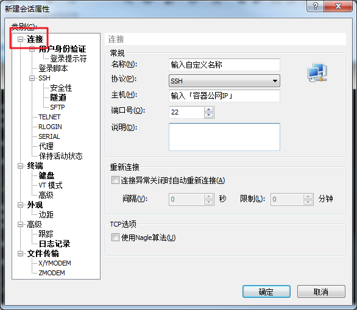

# 如何使用 SSH 密钥登录

## 为什么使用密钥

通常我们使用 SSH 连接并管理远程服务器。默认登录方式为密码认证，看似简单却存在以下问题：

* 无法设置空密码，即使系统允许空密码，亦十分危险；
* 密码容易被偷窥、猜测、窃取、暴力破解等；
* 共享账号时，过多的使用者容易导致密码泄露，修改密码又会影响所有使用者。

因此蜂巢不提供密码登录方式，但支持密钥登录。若使用原生 SSH 客户端登录，需要为容器注入密钥，详见：[如何注入 SSH 密钥](http://support.c.163.com/md.html#!计算服务/容器服务/使用技巧/如何注入SSH密钥.md)。

## 如何使用原生 SSH 客户端

以 Xshell 5 为例，介绍如何使用原生 SSH 客户端。

1、安装并运行 Xshell，点击「文件」-「新建」，在「连接」目录输入相关信息：

* 名称：输入自定义名称；
* 协议：默认「SSH」；
* 主机：输入服务「公网 IP」（未使用公网需 [配置 VPN](http://support.c.163.com/md.html#!计算服务/容器服务/使用技巧/如何使用蜂巢 OpenVPN.md)，再通过内网 IP 连接）；
* 端口号：默认「22」；

2、在「连接」-「用户身份验证」目录输入相关信息：

* 方法：下拉选择「Public Key」；
* 用户名：输入「root」；   

3、点击「浏览」按钮，弹出「用户密钥」窗口。点击「导入」，选择并导入本地公钥（若未注入密钥，请参考：[如何注入 SSH 密钥](http://support.c.163.com/md.html#!计算服务/容器服务/使用技巧/如何注入SSH密钥.md)），后续点击「确定」即可完成连接。

