# Java 最佳实践

案例示意图：

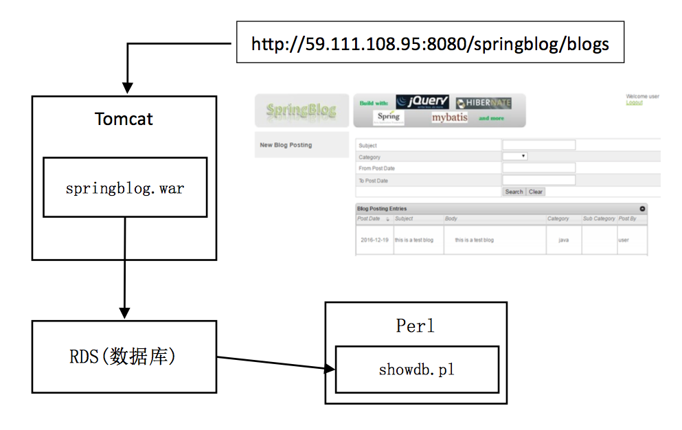

## 1. 编译代码

1.1. 从GitHub上下载代码，这是一个基于Java Spring mybatis的博客系统

	git clone https://github.com/popsuper1982/testtomcat.git

1.2. 使用eclipse打开这个项目，Import一个项目

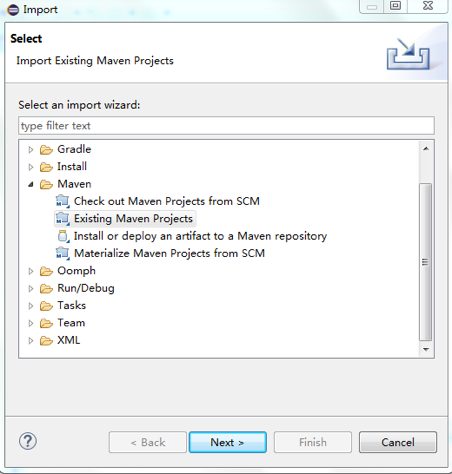

1.3. 通过maven clean和maven install编译war

1.4. 在target目录下有文件 springblog.war

## 2. 将编译结果上传到对象存储

2.1. 登陆网易蜂巢，点击对象存储，创建桶

2.2. 上传springblog.war到这个桶里面

2.3. 对于spring，还需要spring-instrument-tomcat-4.2.2.RELEASE.jar放到这个桶里面

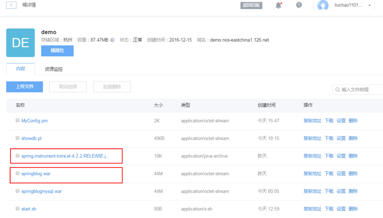

2.4. 准备Entrypoint的脚本start.sh

Note:
在使用容器的最佳实践是不推荐SSH进入容器的，容器中的应用应该在前台运行，应用在则容器在，应用退出则容器退出，这样才能保证不会存在仅仅空容器存在的情况。
这就需要准备一个容器Entrypoint，它的概念是容器刚开始运行的时候，会执行Entrypoint，并且Entrypoint退出，则容器就退出了。

	#!/bin/bash
	echo "${DATABASE_ADDR} springblogdb" >> /etc/hosts
	catalina.sh run

这里DATABASE_ADDR是容器启动的时候，传入的环境变量，是数据库RDS的IP地址，将给它个域名springblogdb。

2.5. start.sh也上传到对象存储里面

## 3. 写一个Dockerfile

FROM 基础镜像
RUN 运行过的所有命令
ADD/COPY 拷贝到容器中的资源
ENTRYPOINT 前台启动的命令或者脚本

	FROM hub.c.163.com/library/tomcat:8.0-jre7
	ENV DATABASE_ADDR 127.0.0.1
	ADD http://demo.nos-eastchina1.126.net/springblogmysql.war /usr/local/tomcat/webapps/springblog.war
	RUN chmod 644 /usr/local/tomcat/webapps/springblog.war
	ADD http://demo.nos-eastchina1.126.net/spring-instrument-tomcat-4.2.2.RELEASE.jar /usr/local/tomcat/lib/spring-instrument-tomcat-4.2.2.RELEASE.jar
	RUN chmod 644 /usr/local/tomcat/lib/spring-instrument-tomcat-4.2.2.RELEASE.jar
	ADD http://demo.nos-eastchina1.126.net/start.sh /usr/local/tomcat/start.sh
	RUN chmod 755 /usr/local/tomcat/start.sh
	ENTRYPOINT /usr/local/tomcat/start.sh

由于这是基于Tomcat的，所以我们使用hub.c.163.com/library/tomcat:8.0-jre7作为基础镜像。

这个镜像可以在镜像仓库里面搜到。

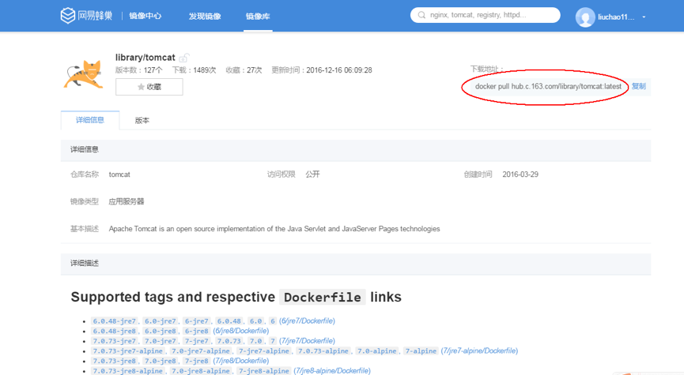

通过ADD命令，将对象存储中的war，jar，start.sh放入容器镜像中，并且修改权限。注意URL地址不是本例子中的地址，而是您自己的地址，可以在对象存储界面上通过复制地址得到这个地址。

将start.sh作为ENTRYPOINT。

## 4. 构建一个镜像

4.1. 在镜像仓库里面，创建镜像仓库，起个名字

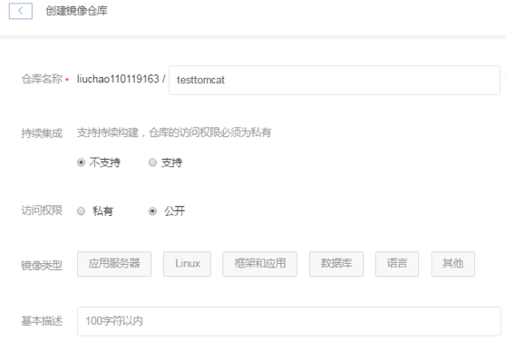

4.2. 点击镜像仓库，点击构建镜像

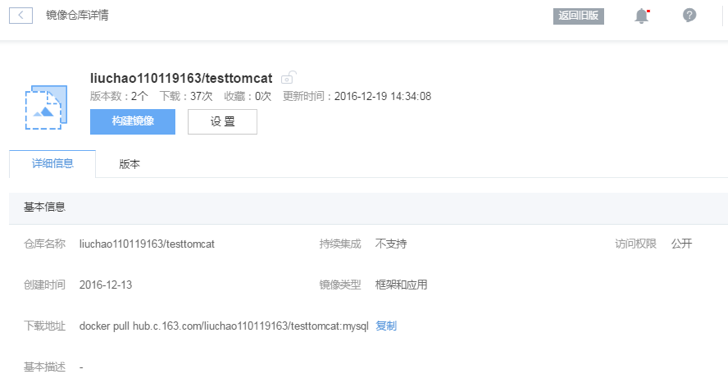

4.3. 在本地选择写好的Dockerfile开始构建

4.4. 构建成功则显示如下：

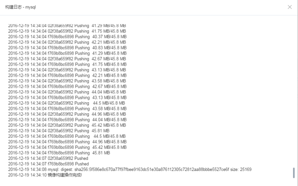

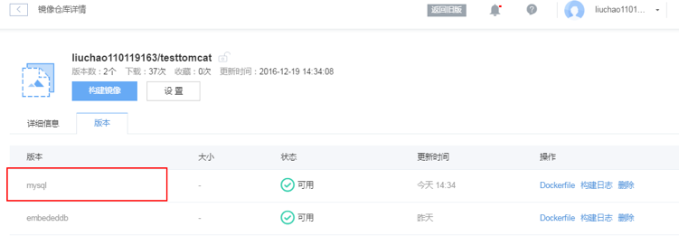

## 5. 创建和初始化数据库

5.1. 点击数据库，点击创建实例，取实例的名字springblogdb，端口号采用默认的3306。

5.2. 点击立即创建

5.3. 点击创建出的数据库，点击数据库和账号

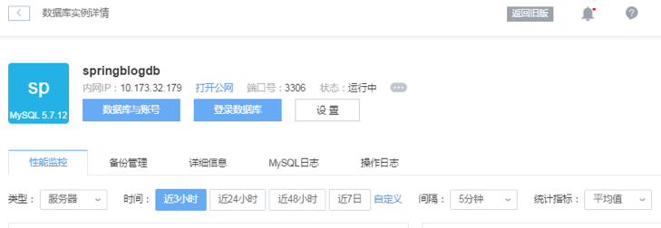

5.4. 在账号管理中，创建账号springblog，密码也为springblog，IP白名单写%

5.5. 在数据库管理中，创建数据库springblog，并且将数据库权限付给springblog账号。

5.6. 在数据库详情实例页，点击登录数据库

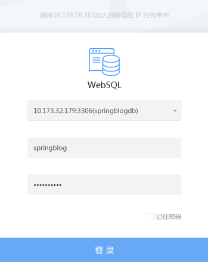

5.7. 可登录在页面上操作数据库

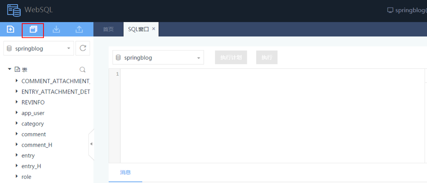

5.8. 点开SQL窗口

5.9. 在代码里面找到，src/main/resources/sql里面找到sql语句。

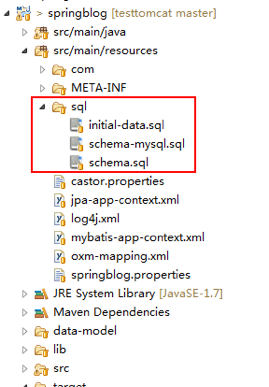

5.10. 先执行schema.sql创建表，然后执行initial-data.sql，初始化数据库中的数据

5.11. 在web界面上，一次只能执行10条语句

## 6. 创建tomcat服务

6.1. 在容器服务中，点击创建服务。

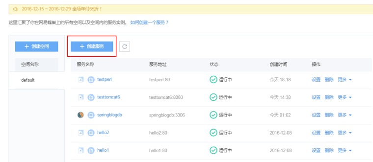

6.2. 填写名称testtomcat，选择无状态

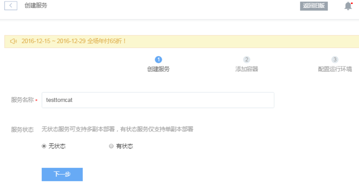

6.3. 镜像选择前面构建的镜像

6.4. 在环境变量里面key为DATABASE_ADDR，value为数据库的IP地址

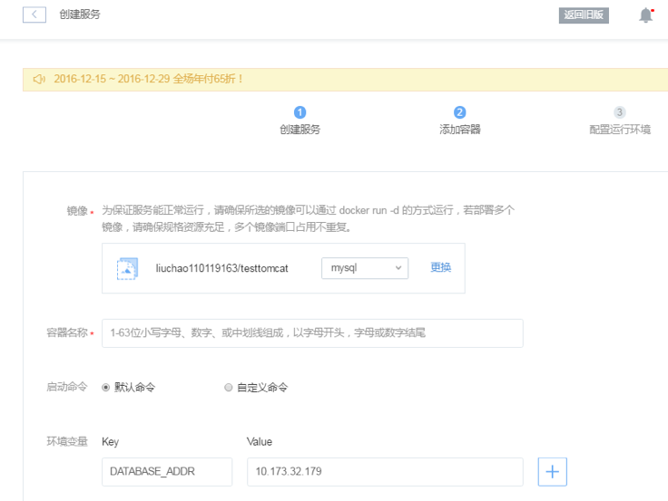

6.5. 选择默认的规格，端口映射为8080映射为8080

6.6. 点击立即创建。等待创建成功

## 7. 创建负载均衡器

7.1. 在负载均衡页面，点击创建负载均衡，取名testtomcat

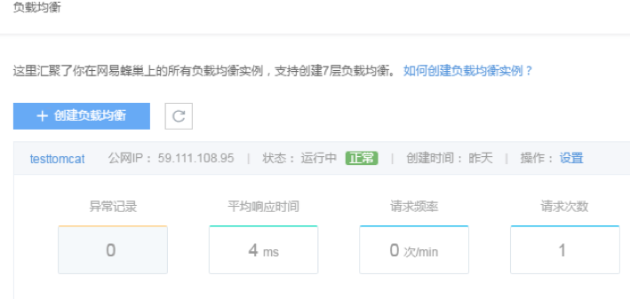

7.2. 点击创建监听，取名testtomcat，监听端口8080，映射为testtomcat服务的8080

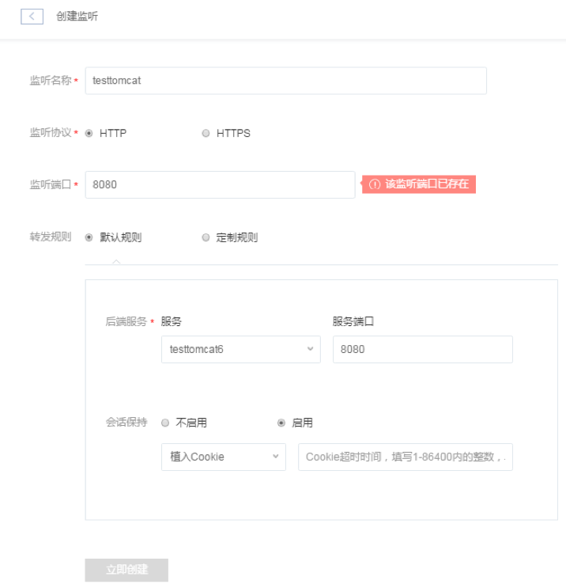

## 8. 访问页面

8.1. 使用负载均衡的IP地址加上8080端口访问tomcat

8.2. 使用user/user登陆，创建一个博客

## 9. 写一个perl访问数据库的脚本

	#!/bin/perl
	# load module
	use DBI;
	# connect
	my $dbh = DBI->connect("DBI:mysql:database=springblog;host=springblogdb", "springblog", "springblog", {'RaiseError' => 1});
	# execute SELECT query
	my $sth = $dbh->prepare("SELECT subject, body FROM entry_H");
	$sth->execute();
	# iterate through resultset
	# print values
	while ( my ($subject, $body) = $sth->fetchrow_array() ) {
	    print "subject: $subject \n";
	    print "body: $body \n";
	    print "---------- ";
	}
	# clean up
	$dbh->disconnect();

## 10. 将脚本上传到对象存储

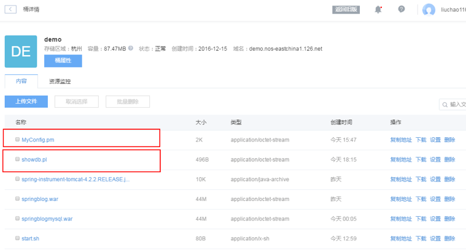

Showdb.pl就是上面的脚本

MyConfig.pm是perl中安装DBI包的配置

## 11. 写一个Dockerfile

	FROM hub.c.163.com/library/perl:5.24.0-threaded
	ENV DATABASE_ADDR 127.0.0.1
	RUN mkdir -p /root/.cpan/CPAN/
	ADD http://demo.nos-eastchina1.126.net/MyConfig.pm /root/.cpan/CPAN/MyConfig.pm
	RUN chmod -R 755 /root/.cpan
	RUN perl -MCPAN -e "install DBI"
	RUN perl -MCPAN -e "install DBD::mysql"
	ADD http://demo.nos-eastchina1.126.net/showdb.pl /root/showdb.pl
	RUN chmod 755 /root/showdb.pl
	RUN echo "deb http://mirrors.163.com/debian/ jessie main non-free contrib" > /etc/apt/sources.list &&\
	echo "deb http://mirrors.163.com/debian/ jessie-updates main non-free contrib" >> /etc/apt/sources.list &&\
	echo "deb http://mirrors.163.com/debian/ jessie-backports main non-free contrib" >> /etc/apt/sources.list &&\
	echo "deb http://mirrors.163.com/debian-security/ jessie/updates main non-free contrib" >> /etc/apt/sources.list &&\
	apt-get -y update &&\
	apt-get -y install openssh-server
	RUN mkdir -p /var/run/sshd && chmod 0755 /var/run/sshd
	ENTRYPOINT /usr/sbin/sshd -D

## 12. 构建一个镜像

12.1 镜像构建既可以如上面，在界面上操作；也可以在linux环境下面使用docker build操作。

12.2 登陆镜像库

	docker login -u liuchao110119163@163.com -p 您的密码 -e liuchao110119163@163.com hub.c.163.com

12.3 构建本地镜像，在Dockerfile_perl的同目录下。

	docker build -f Dockerfile_perl -t hub.c.163.com/liuchao110119163/testperl:4 .

12.4 将本地镜像推送到网易镜像库。

	docker push hub.c.163.com/liuchao110119163/testperl:4

## 13. 创建perl服务

选择perl的镜像创建

## 14. perl访问数据库

14.1 在testperl服务中，点击console，进入容器。

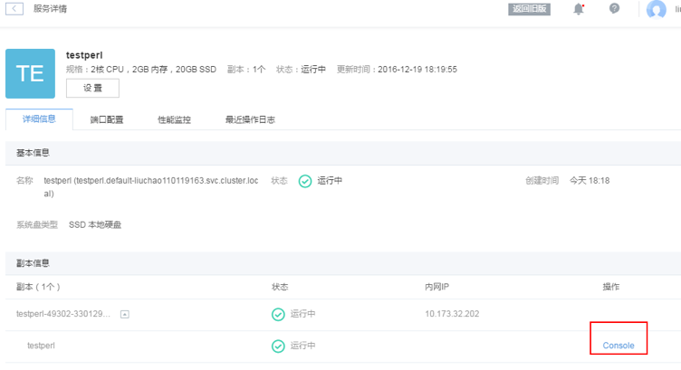

14.2 在/etc/hosts里面将springblogdb对应数据库的IP写入

	echo "10.173.32.179 springblogdb" >> /etc/hosts

14.3 运行perl showdb.pl，可以看到数据库中的内容

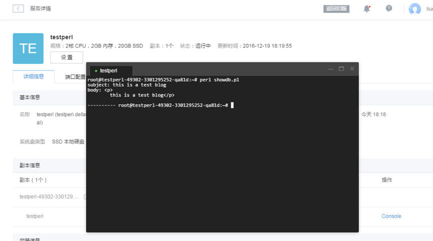

