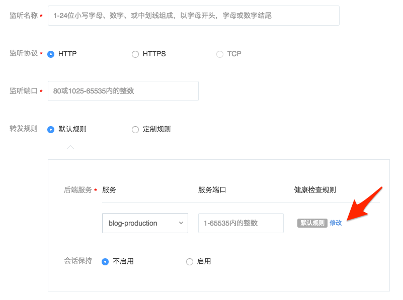

# 配置健康检查

负载均衡支持四层和七层的自定义主动健康检查。可以根据用户配置参数，在后端服务副本宕机时，会自动将对应节点从负载均衡的转发列表中移出，并在服务恢复时自动将其恢复，保证服务的高可用。负载均衡健康检查机制提高了前端业务整体可用性，避免了后端异常对总体服务的影响。

特殊情况下，用户业务如果对负载有高敏感性，高频率的健康检查探测可能会对用户正常业务访问造成影响。用户可以结合业务情况，通过降低健康检查频率、增大健康检查间隔、七层检查修改为四层检查等方式，来降低对业务的影响。

Note:
使用推荐的默认规则即可满足一般使用场景。

在 [创建监听或修改监听](http://support.c.163.com/md.html#!计算服务/负载均衡/使用指南/创建负载均衡.md) 时，可以自定义健康检查规则：

## 规则字段

|   字段   |                        说明                        |                  取值范围                 |   七层默认  | 四层默认 |
|----------|----------------------------------------------------|-------------------------------------------|-------------|----------|
| 检测规则 | 使用推荐的默认规则即可满足一般使用场景 | -                                         | -           | -        |
| 监控协议 | 支持四层（TCP）、七层（HTTP）                      | -                                         | -           | -        |
| 检查路径 | 七层健康检测访问请求的路径，建议对静态页面进行检查 | 最长 128，以“/”开头，字母、数字、"."或"/" | /index.html | -        |
| 检查间隔 | 两次健康检查请求之间的间隔时间，单位 ms            | [5000,300000]                             | 5000        | 5000     |
| 响应超时 | 请求异常判定的超时时间，单位 ms                    | [2000,60000]                              | 5000        | 2000     |
| 故障阈值 | 连续几次请求异常后，判定负载均衡后端故障           | [2,10]                                    | 3           | 3        |
| 健康阈值 | 连续几次请求正常后，判定负载均衡后端恢复健康       | [2,10]                                    | 2           | 2        |
| 状态码   | 七层健康检查请求返回哪些状态码判定后端健康         | 2xx、3xx                                  | 2xx、3xx    | -        |

### 四层服务（TCP）

### 七层服务（HTTP）

