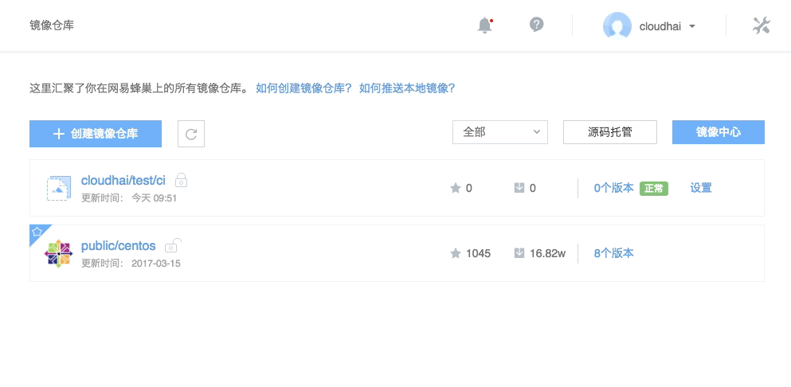
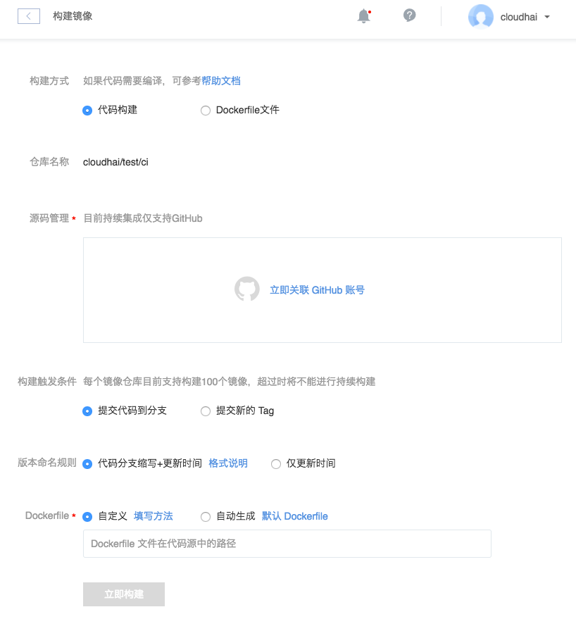

# 代码构建（持续集成）

Note:
1. 若没有镜像仓库，请先 [创建镜像仓库](http://support.c.163.com/md.html#!计算服务/镜像仓库/使用指南/创建镜像仓库.md)； 2. 创建镜像仓库时，请选择支持持续集成（目前支持 GitHub 源码托管）； 3. 持续集成最佳实践，详见 [如何进行持续集成](http://support.c.163.com/md.html#!计算服务/容器服务/使用指南/如何进行持续集成.md)。

## 操作步骤

1. 登录 [控制台](https://c.163.com/dashboard#/m/mirrorRepo/)，定位「**镜像仓库**」标签；
2. 定位并进入需要构建镜像的镜像仓库（需支持持续集成）；
3. 在「**镜像仓库详情**」页，点击「**构建镜像**」按钮：

4. 构建方式选择「**代码构建**」（如 Java 之类的代码如需要编译，请参考：[如何在构建镜像时编译代码](http://support.c.163.com/md.html#!计算服务/镜像仓库/使用技巧/如何在构建镜像时编译代码.md)）：

5. 选择源码及分支
需关联 GitHub 账号
选择项目后不可更改，可以切换分支
6. 设定构建出发条件：
**提交代码到分支**：提交代码到之前设定的分支后，触发构建；
**提交新的 Tag**：提交新的 Tag 到代码仓库后，触发构建。
7. 设定镜像的版本命名规则：
**代码分支缩写+更新时间**：如 master20170109045830019；
**仅更新时间**：如 20170109045830019。
8. 选择 Dockerfile：
**自定义 Dockerfile**（推荐）：需指定 Dockerfile 文件在代码源中的绝对路径，详见：[如何填写自定义 Dockerfile](http://support.c.163.com/md.html#!计算服务/镜像仓库/使用技巧/自定义Dockerfile填写方法.md)；
**默认 Dockerfile**：使用蜂巢默认 Dockerfile 需遵循一定的规则，详见：[默认 Dockerfile 说明](http://support.c.163.com/md.html#!计算服务/镜像仓库/使用技巧/默认 Dockerfile.md)。
9. 确认信息，点击「立即构建」按钮，开始构建镜像。

Attention:
若遇到构建失败的情况，请根据构建日志排障，再 push 到 GitHub 后将自动触发构建；
若遇到点击「立即构建」按钮后，出现提示「系统繁忙」，请确认你的 GitHub 项目 ➡ Settings ➡  Webhooks 内是否已达到 20 条上限；
每个镜像仓库目前支持构建 100 个镜像，超过时将不能进行持续构建；
托管的源码，选择项目后不可更改，可以切换分支。