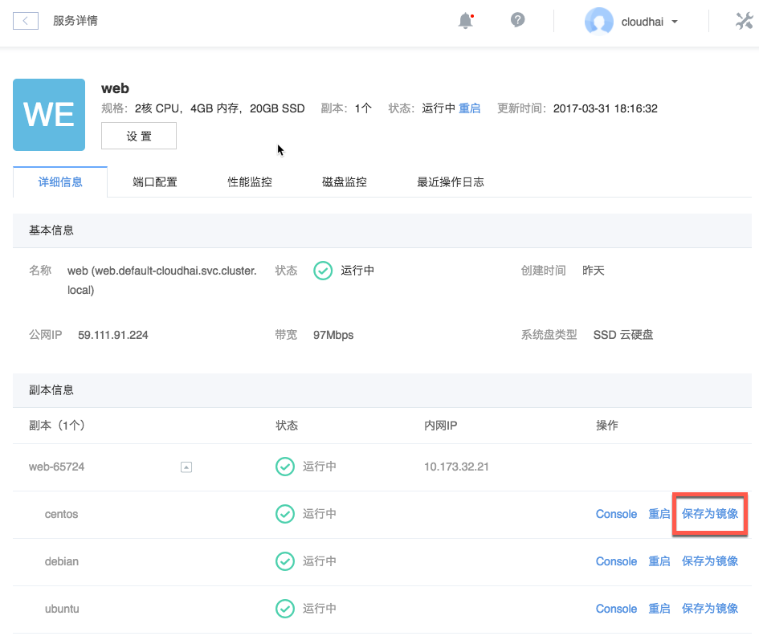
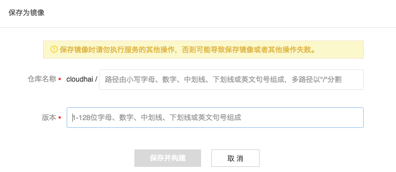

# 服务内容器保存为镜像

Attention:
保存镜像时请勿执行服务的其他操作，否则可能导致保存镜像或者其他操作失败。

## 操作步骤

1. 登录 [控制台](https://c.163.com/dashboard#/m/microservice/)，定位「**服务管理**」标签；
2. 定位到需要保存镜像的服务；
3. 在「**服务详情**」页面，找到「**副本信息**」；
4. 定位到对应副本内的对应容器；
5. 点击「**保存镜像**」：

6. 在弹出的对话框内，输入镜像名称和版本，点击「保存并构建」即可。

Attention:
每个镜像仓库目前支持构建 100 个镜像，超过时将不能进行构建。

**仓库名称命名规则**：
* 支持多路径，以"/"分割；
* 使用小写字母、数字、中划线、下划线、英文句号；
* 以小写字母或数字开头结尾；
* 不包含连续的特殊字符。
* `<username>/<repo_name>` 的总长度不能超过 200 个字符（其中 username 为用户名，repo_name 为你填写的仓库名称。例如对于镜像 nofrish/nginx 来说，长度为 13 而不是 5）。

**仓库路径说明**：
* 保存至不存在的镜像仓库时，自动创建镜像仓库并保存新的镜像版本；
* 保存至已存在的镜像仓库时，在该镜像仓库中保存新的版本，当版本号相同时覆盖原有镜像。