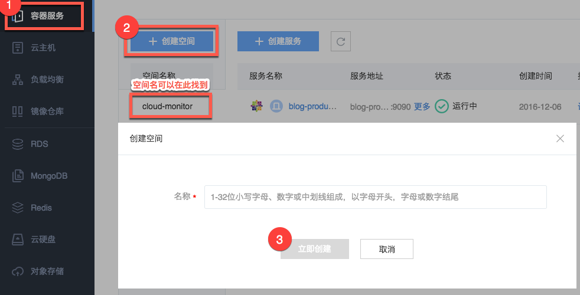
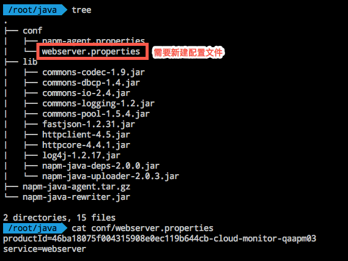

# 在容器中部署 Java 探针

通过部署探针，即可实现业务的全链路跟踪和异常捕获。

* **适用版本：**Tomcat7 及其以上版本、JDK 1.6 及其以上版本部署的 Java 服务
* **可监控协议：**HTTP、Redis、Memcached、DB、RabbitMQ、Dubbo
* **支持部署方式：**
	* [直接在蜂巢容器中部署探针](../md.html#!运维工具/性能监控-新版/性能监控使用指南/部署探针/部署Java探针.md)
		**使用场景：**在蜂巢已有运行中的容器，希望直接在容器中部署探针
	* [通过 Dockerfile 部署探针](../md.html#!运维工具/性能监控-新版/性能监控使用指南/部署探针/部署Java探针-容器-Dockerfile.md)
		**使用场景：**代码已经上传到代码托管服务，并且项目中包含 Dockerfile 文件用于构建镜像，希望通过 Dockerfile 方部署探针。 
	* [在任意主机中部署探针](../md.html#!运维工具/性能监控-新版/性能监控使用指南/部署探针/部署Java探针-主机.md)
		**使用场景：**在任意主机（包括但不限于蜂巢）上直接部署探针

## 操作步骤
### 1. 下载探针安装包

登录目标实例，下载 [Java探针安装包](http://nos.netease.com/agent/napm-java-agent.tar.gz )：

	mkdir /root/java/ # /root/java/ 可按需替换
	cd /root/java/
	wget http://nos.netease.com/agent/napm-java-agent.tar.gz
	tar zxvf napm-java-agent.tar.gz

### 2. 获取 productId

productId 用于添加配置文件：

	# productId 组成规则为 productId={租户 id}-{服务空间名}-{用户名}
	productId=46ba18075f004315908e0ec119b644cb-cloud-monitor-qaapm03

* **获取租户 id：**每个蜂巢账号对应一个租户 id，请 [提交工单](https://c.163.com/dashboard#/m/ticket/create/?type=%E7%9B%91%E6%8E%A7) 联系我们获取；
* **创建服务空间：**进入控制台 ➡ [容器服务](https://c.163.com/dashboard#/m/microservice/) ➡ 创建空间：
* **获取用户名：**在 [控制台](https://c.163.com/dashboard) 右上角获取

	

### 3. 添加配置文件

探针安装包解压后，须在 `conf` 目录下新建配置文件（本示例中为 webserver.properties，建议文件名和文件中的 service 一致），文件内容如下：

	# 上一步骤中获取的 productId
	productId=46ba18075f004315908e0ec119b644cb-cloud-monitor-qaapm03
 
	# service 为服务名（进程功能，如管理服务器、报警服务器等），可以任意命名
	# 为避免冲突建议和监控的服务进程名相同，各模块以模块名开头命名，如 webServer、alertServer
	service=webserver

	#（选填）node 为具体部署的节点名称，默认会自动获取主机的 hostname
	node=pubt1-lxc1-cm1.c.163.org

### 4. 增加 Java 启动参数

修改配置文件后，需要在 Tomcat 或 Java 服务中添加启动参数，具体方式如下：

#### 4.1. Tomcat 添加参数

	export CATALINA_OPTS='-javaagent:/root/java/napm-java-rewriter.jar=conf=webserver.properties'

或者修改 `/tomcat/bin/catalina.sh` 脚本，在 JAVA_OPTS 内添加如下启动参数：

    -javaagent:/root/java/napm-java-rewriter.jar=conf=webserver.properties

#### 4.2. Java 服务添加参数

Java 服务启动时直接加上以下参数：

    -javaagent:/root/java/napm-java-rewriter.jar=conf=webserver.properties

服务启动后，在 [应用监控模块](https://c.163.com/dashboard#/m/apm/) 可以看到全链路数据展示的变化：

