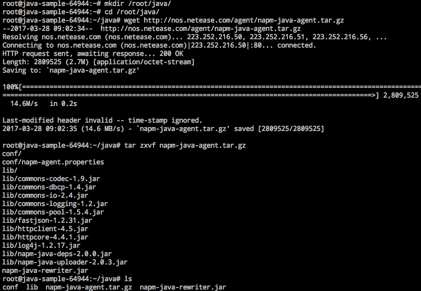

# 直接在容器中部署 Java 探针

通过部署探针，即可实现业务的全链路跟踪和异常捕获。

* **适用版本：**Tomcat7 及其以上版本、JDK 1.6 及其以上版本部署的 Java 服务
* **可监控协议：**HTTP、Redis、Memcached、DB、RabbitMQ、Dubbo
* **支持部署方式：**
	* [直接在蜂巢容器中部署探针](../md.html#!运维工具/性能监控-新版/性能监控使用指南/部署探针/部署Java探针.md)
		**使用场景：**在蜂巢已有运行中的容器，希望直接在容器中部署探针
	* [通过 Dockerfile 部署探针](../md.html#!运维工具/性能监控-新版/性能监控使用指南/部署探针/部署Java探针-容器-Dockerfile.md)
		**使用场景：**代码已经上传到代码托管服务，并且项目中包含 Dockerfile 文件用于构建镜像，希望通过 Dockerfile 方部署探针。 
	* [在任意主机中部署探针](../md.html#!运维工具/性能监控-新版/性能监控使用指南/部署探针/部署Java探针-主机.md)
		**使用场景：**在任意主机（包括但不限于蜂巢）上直接部署探针

## 操作步骤

### 1. 下载探针安装包

打开目标实例的 [WebConsle](../md.html#!计算服务/容器服务/使用技巧/如何使用蜂巢WebConsole.md)（或 [SSH](../md.html#!计算服务/容器服务/使用技巧/如何使用 SSH 密钥登录.md) 目标实例），下载 [Java探针安装包](http://nos.netease.com/agent/napm-java-agent.tar.gz)：

	mkdir /root/java/
	cd /root/java/
	wget http://nos.netease.com/agent/napm-java-agent.tar.gz
	tar zxvf napm-java-agent.tar.gz

### 2. 增加 Java 启动参数

以 Tomcat8 为例，修改 `/tomcat8/bin/catalina.sh` 脚本，在 JAVA_OPTS 内添加如下启动参数：

	-javaagent:<user_agent_dir>/napm-java-rewriter.jar

### 3. 保存镜像

详见：[如何保存镜像](http://support.c.163.com/md.html#!计算服务/容器服务/使用指南/如何保存镜像.md) 。

### 4. 启用新镜像

无状态服务支持直接更改镜像版本；有状态服务需要使用保存的镜像重新创建服务。
服务启动后，在 [应用监控模块](https://c.163.com/dashboard#/m/apm/) 可以看到全链路数据展示的变化：

